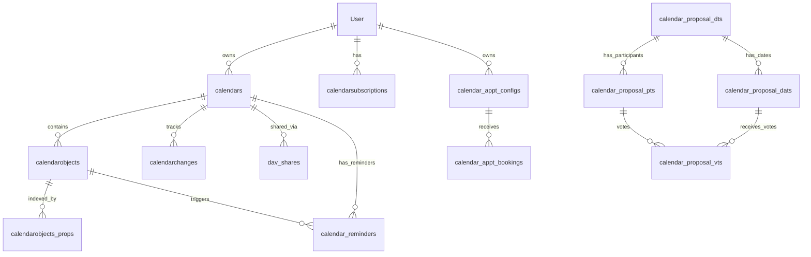

# Liste Complète des Tables Calendrier Nextcloud (15 Tables)

Ce document regroupe **toutes** les tables utilisées par le calendrier Nextcloud, provenant à la fois du Core (serveur CalDAV) et de l'App Calendar (fonctionnalités additionnelles).

**Note** : Dans une installation Nextcloud réelle, toutes ces tables sont préfixées par `oc_` (ex: `oc_calendars`).

---

## 📦 A. Tables Core CalDAV (9 Tables)
*Source : `apps/dav/lib/Migration/`*

Ces tables gèrent le stockage, la synchronisation et le partage des événements standards (RFC 5545).

### 1. `calendars`
La table principale des calendriers.
- **id**: ID unique
- **principaluri**: Propriétaire (ex: `principals/users/admin`)
- **displayname**: Nom du calendrier
- **uri**: Identifiant URL
- **synctoken**: Pour la synchro
- **components**: Types supportés (VEVENT, VTODO)

### 2. `calendarobjects`
Les événements eux-mêmes.
- **id**: ID unique
- **calendarid**: Lien vers `calendars`
- **calendardata**: **BLOB** contenant le iCal complet (RFC 5545)
- **uri**: UID du fichier .ics
- **lastmodified**, **etag**: Pour la synchro

### 3. `calendarchanges`
Historique des modifications pour la synchronisation incrémentale.
- **uri**: URI de l'objet modifié
- **operation**: 1=Ajout, 2=Modif, 3=Suppression

### 4. `calendarsubscriptions`
Abonnements à des calendriers externes (WebCal).
- **source**: URL du calendrier externe
- **refreshrate**: Fréquence de mise à jour

### 5. `schedulingobjects`
Messages de planification (invitations, réponses FreeBusy).
- **calendardata**: Contenu iTIP

### 6. `calendarobjects_props`
Index des propriétés pour la recherche rapide (évite de parser le BLOB).
- **name**: Nom de la propriété (ex: LOCATION)
- **value**: Valeur

### 7. `dav_shares`
Gestion des partages (utilisé aussi pour les contacts).
- **resourceid**: ID du calendrier
- **access**: Niveau d'accès (Lecture/Écriture)
- **principaluri**: Utilisateur qui partage

### 8. `calendar_reminders` (Ajouté en 2019)
Gestion des rappels/alarmes.
- **notification_date**: Quand envoyer le rappel
- **type**: Email, Audio, Display

### 9. `calendars_federated` (Ajouté en 2025)
Partage de calendriers entre instances Nextcloud différentes.
- **remote_Url**: URL de l'instance distante
- **token**: Auth token

---

## 📱 B. Tables App Calendar (6 Tables)
*Source : `apps/calendar/lib/Migration/`*

Ces tables gèrent les fonctionnalités spécifiques à l'interface web Nextcloud (Prise de RDV et Sondages).

### 10. `calendar_appt_configs`
Configuration des pages de prise de rendez-vous (Booking).
- **token**: URL publique
- **availability**: Règles de disponibilité (RRULE)
- **duration**: Durée des créneaux

### 11. `calendar_appt_bookings`
Les rendez-vous pris par des externes.
- **appt_config_id**: Lien vers la config
- **email**: Email du participant
- **start**, **end**: Heure du RDV

### 12. `calendar_proposal_dts`
Sondages de dates (Doodle-like) - Détails.
- **title**, **description**: Infos du sondage

### 13. `calendar_proposal_pts`
Participants aux sondages.
- **name**, **address**: Identité
- **token**: Lien unique de vote

### 14. `calendar_proposal_dats`
Dates proposées dans le sondage.
- **date**: Timestamp

### 15. `calendar_proposal_vts`
Votes des participants.
- **vote**: YES, NO, MAYBE

---

## 🔗 Relations Globales

