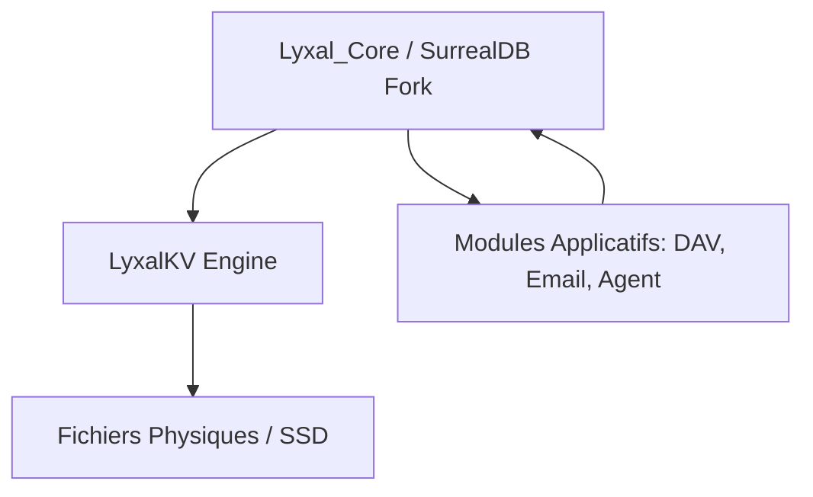

# Architecture Lyxal : Intégration de LyxalKV dans Lyxal_Core

Ce document définit la relation structurelle entre le moteur de stockage bas-niveau **LyxalKV** et le socle applicatif **Lyxal_Core**.

---

## 1. LyxalKV : Le Moteur de Persistance
**LyxalKV** est l'implémentation native du moteur Key-Value (LSM-Tree). Il gère la réalité physique des données sur le disque.
* **Rôle** : Écriture atomique, gestion du WAL (Write Ahead Log), compaction des SSTables.
* **Localisation actuelle** : `lyxal_solution_backend\lyxalkv`.
* **Intégration** : Il est déjà injecté dans le fork de **SurrealDB 3.0** (`surrealdb\core\src\kvs\lyxalkv`).

---

## 2. Lyxal_Core : Le Cœur du Système (Kernel)
**Lyxal_Core** (fusionné avec le fork de SurrealDB) agit comme l'OS de la solution. Il fournit les abstractions nécessaires aux modules (`lyxal_dav`, `lyxal_agent`, etc.).

### Pourquoi LyxalKV fait partie de Lyxal_Core ?
Dans une architecture de "Cloud OS", le système de fichiers (le stockage) ne peut pas être une pièce rapportée. Il doit être fusionné au noyau pour garantir :
1. **L'Identité Native** : Les utilisateurs et permissions sont stockés directement via LyxalKV au démarrage du noyau.
2. **La Performance** : En étant "partie intégrante" de Lyxal_Core, LyxalKV élimine les couches d'abstraction inutiles.
3. **Le Consensus (Raft)** : Le moteur KV est le support direct de la réplication d'état gérée par Lyxal_Core.

---

## 3. Hiérarchie de Dépendance

---

## 4. Conclusion
**Oui, LyxalKV est le bras armé de Lyxal_Core.** 
Toute instance de Lyxal qui démarre initialise son `lyxalkv` via son `lyxal_core`. C'est l'unique moyen d'assurer que chaque **Realm** (Instance Client) possède son propre silo de données physiquement isolé tout en étant piloté par un code unique.

---
*Document de référence généré pour la validation de la stack Lyxal Solution.*
