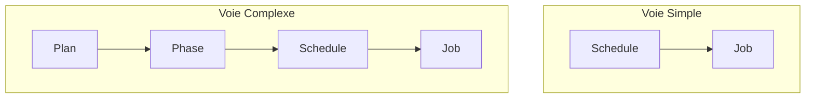

# Architecture de Planification Stratégique et Atomique

Ce document décrit une architecture de planification unifiée, conçue pour gérer à la fois des **déclenchements simples et atomiques** et des **stratégies complexes et hiérarchiques**. L'objectif est de fournir un système d'une flexibilité maximale, entièrement intégré à SurrealDB.

---

## 1. Le Double Besoin

Le système doit répondre à deux cas d'usage distincts mais complémentaires :

1.  **Les Tâches Atomiques :** Déclencher une action simple à un moment précis, sans la lier à un projet plus large.
    *   *Exemple :* "Envoyer une notification de rappel 30 minutes avant un rendez-vous."

2.  **Les Stratégies Complexes :** Orchestrer plusieurs actions différentes dans le temps, selon un scénario à plusieurs étapes.
    *   *Exemple :* "Déployer une campagne marketing sur 3 mois, avec une phase de teasing, une phase de lancement et une phase de suivi."

---

## 2. Le Modèle Conceptuel Unifié

La clé de l'architecture est que le **Déclencheur (`schedule`) est la brique de base**. Il peut exister seul ou être intégré dans une hiérarchie.

*   **L'Action (`scheduler_job`) :**
    *   **Rôle :** L'unité de travail atomique, l'action technique (`fn::...`).
    *   **Exemple :** `fn::crm::send_email`

*   **Le Déclencheur (`scheduler_schedule`) :**
    *   **Rôle :** Définit **QUAND** et **SOUS QUELLES CONDITIONS** une action (`job`) doit être exécutée. C'est l'élément central.
    *   *Il est TOUJOURS lié à un `job`.*

*   **La Stratégie (`scheduler_plan` et `scheduler_plan_phase`) :**
    *   **Rôle :** Un conteneur **OPTIONNEL** pour regrouper et orchestrer des déclencheurs dans un scénario métier.
    *   *Un `schedule` peut appartenir à une `phase` (qui appartient à un `plan`).*

---

## 3. Proposition de Structure des Données

### a. `scheduler_job` (Inchangé)
Représente l'action atomique, le "QUOI".

### b. `scheduler_plan` et `scheduler_plan_phase` (Inchangés)
Représentent la stratégie optionnelle, le "POURQUOI".

### c. `scheduler_schedule` (Clé de l'architecture)

| Champ | Type | Description |
|---|---|---|
| `job_id` | `record<scheduler_job>` | **Obligatoire.** L'action à exécuter. |
| `phase_id` | `option<record<scheduler_plan_phase>>`| **Optionnel.** La phase stratégique à laquelle ce déclencheur appartient. |
| `type` | `string` | `RECURRING` ou `ONE_SHOT`. |
| `start_date`, `end_date` | `option<datetime>` | Fenêtre de validité. |
| `execution_date` | `option<datetime>` | Pour `ONE_SHOT`. |
| `minutes`, `hours` ... | `option<string>` | Pour `RECURRING` (Format CRON). |
| `day_interval`, `week_interval` | `number` | Fréquences pour `RECURRING`. |
| `validation_function`| `option<string>` | Logique métier conditionnelle. |
| `timezone` | `string` | Fuseau horaire de la planification. |

---

## 4. Logique de Sélection Unifiée

La fonction de sélection des tâches à exécuter suivra cette logique :

1.  Elle sélectionne **tous** les `schedule` dont la condition temporelle (CRON, `ONE_SHOT`, etc.) correspond à l'heure actuelle.
2.  Pour chaque `schedule` sélectionné, elle vérifie s'il est lié à une `phase` :
    *   **Si `phase_id` est `NULL` :** Le déclencheur est atomique et valide.
    *   **Si `phase_id` est défini :** Elle doit remonter la hiérarchie pour vérifier que la `phase` et le `plan` parent sont actuellement actifs (date valide, statut `Active`). Si ce n'est pas le cas, le déclencheur est ignoré.
3.  Si le déclencheur est jugé valide (atomique ou dans une phase active), la `validation_function` (si elle existe) est exécutée.
4.  Si tout est validé, le `job_id` du déclencheur est ajouté à la liste des actions à exécuter.

---

## 5. Points à Clarifier (Inchangés)

Les questions sur la gestion des transitions de phase, l'héritage, et les templates de plans restent pertinentes pour la "Voie Complexe" et pourront être affinées.

Cette architecture unifiée nous donne le meilleur des deux mondes : une grande simplicité pour les tâches du quotidien et une puissance quasi-infinie pour les scénarios stratégiques.
