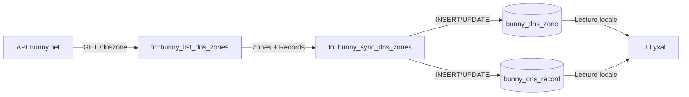

# 🌐 Bunny DNS - Tables Database

## 📋 Vue d'ensemble

Ce module contient les **tables miroir** de l'API Bunny.net pour la gestion DNS.

**Objectif** : Synchroniser et stocker localement les zones DNS et records pour :
- ✅ **Performance** : requêtes locales rapides sans appeler l'API
- ✅ **Cache** : réduire les appels API
- ✅ **Historique** : conserver les données même si supprimées sur Bunny
- ✅ **Multi-tenant** : associer les zones à des tenants Lyxal
- ✅ **Audit** : tracer les modifications

---

## 📁 Structure des fichiers

```
infrastructure/database/dns/
├── README.md                    # Ce fichier
├── bunny_dns_zone.surql        # Table des zones DNS
└── bunny_dns_record.surql      # Table des records DNS
```

---

## 🗄️ Tables

### **`bunny_dns_zone`**

**Description** : Zones DNS gérées via Bunny.net

**Champs principaux** :
- `bunny_id` (int) : ID unique Bunny.net
- `domain` (string) : Nom de domaine (ex: `lyxal.com`)
- `nameserver1`, `nameserver2` (string) : Nameservers Bunny
- `dnssec_enabled` (bool) : DNSSEC activé
- `logging_enabled` (bool) : Logs DNS activés
- `certificate_key_type` (string) : Type de clé SSL (`Ecdsa`, `Rsa`)
- `date_created`, `date_modified` (datetime) : Dates Bunny.net
- `metadata` (object) : Métadonnées Lyxal (tenant, status, synced_at)

**Index** :
- `bunny_id` (UNIQUE)
- `domain`
- `metadata.tenant`
- `metadata.status`

### **`bunny_dns_record`**

**Description** : Records DNS (A, AAAA, CNAME, MX, TXT, etc.)

**Champs principaux** :
- `bunny_id` (int) : ID unique Bunny.net
- `zone_id` (int) : Référence vers `bunny_dns_zone.bunny_id`
- `type` (string) : Type de record (13 types supportés)
- `name` (string) : Nom du record (ex: `www`, `@`, `mail`)
- `value` (string) : Valeur du record
- `ttl` (int) : Time To Live en secondes
- `priority`, `weight`, `port` (int) : Champs spécifiques (MX, SRV)
- `accelerated` (bool) : Accélération via CDN Bunny
- `smart_routing_type` (string) : Routing intelligent
- `monitor_type`, `monitor_status` (string) : Monitoring
- `metadata` (object) : Métadonnées Lyxal (status, synced_at)

**Types de records supportés** :
- `A` : IPv4 address
- `AAAA` : IPv6 address
- `CNAME` : Canonical name
- `TXT` : Text record
- `MX` : Mail exchange
- `Redirect` : HTTP redirect
- `Flatten` : CNAME flattening
- `PullZone` : Bunny CDN Pull Zone
- `SRV` : Service record
- `CAA` : Certification Authority Authorization
- `PTR` : Pointer record
- `Script` : Edge Script
- `NS` : Name server

**Index** :
- `bunny_id` (UNIQUE)
- `zone_id`
- `zone_id, name, type` (composite)
- `type`
- `metadata.status`

---

## 🎯 Décisions d'architecture

### **1. Approche "Miroir API"**

Les tables sont des **copies exactes** de la structure API Bunny.net :
- ✅ **Avantage** : synchronisation simple, pas de mapping complexe
- ✅ **Avantage** : structure alignée avec la documentation API
- ✅ **Avantage** : évolutif si Bunny ajoute des champs

**Alternative considérée** :
- ❌ Structure personnalisée avec champs métier Lyxal uniquement
- **Rejetée car** : mapping complexe, perte de données API, maintenance difficile

### **2. Enums stockés en STRING** ⚠️ **Décision importante**

**Choix actuel** : Les enums sont stockés en **STRING** directement :

```sql
DEFINE FIELD type ON bunny_dns_record
  TYPE string
  ASSERT $value INSIDE ['A', 'AAAA', 'CNAME', ...]
```

**Pourquoi STRING et pas RECORD ?**

| Critère | STRING (actuel) | RECORD (alternative) |
|---------|----------------|---------------------|
| **Fidélité API** | ✅ Miroir exact | ❌ Mapping requis |
| **Performance** | ✅ Aucune jointure | ❌ Jointures nécessaires |
| **Lisibilité** | ✅ `type: 'A'` | ❌ `type: dns_type:a3x7z` |
| **Synchronisation** | ✅ Simple | ❌ Complexe |
| **Métadonnées** | ❌ Aucune | ✅ Description, icône, etc. |

**Décision** : ✅ **Garder STRING** pour rester fidèle à l'API

**Alternative future** (si besoin de métadonnées UI) :
- Créer des **tables de référence optionnelles** séparées :
  - `dns_record_type_ref` (avec description, icône, couleur)
  - `monitor_type_ref`
  - `smart_routing_type_ref`
- **MAIS** : ne pas les utiliser comme foreign key dans les tables miroir
- **Usage** : uniquement pour l'UI/affichage

**Exemple de table de référence future** :
```sql
DEFINE TABLE dns_record_type_ref SCHEMAFULL;
DEFINE FIELD code ON dns_record_type_ref TYPE string; -- 'A'
DEFINE FIELD name ON dns_record_type_ref TYPE string; -- 'IPv4 Address'
DEFINE FIELD description ON dns_record_type_ref TYPE string;
DEFINE FIELD icon ON dns_record_type_ref TYPE string; -- 'globe'
DEFINE FIELD color ON dns_record_type_ref TYPE string; -- '#3B82F6'
DEFINE FIELD order ON dns_record_type_ref TYPE int; -- Ordre d'affichage
```

### **3. Relation Zone ↔ Record**

**Choix actuel** : `zone_id` (int) au lieu de `zone` (record)

```sql
DEFINE FIELD zone_id ON bunny_dns_record
  TYPE int
  ASSERT $value != NONE
  COMMENT 'Zone ID - Référence vers bunny_dns_zone.bunny_id';
```

**Pourquoi INT et pas RECORD ?**

| Critère | INT (actuel) | RECORD (alternative) |
|---------|-------------|---------------------|
| **Fidélité API** | ✅ Bunny retourne un ID | ❌ Mapping requis |
| **Synchronisation** | ✅ Direct depuis API | ❌ Lookup SurrealDB |
| **Performance** | ⚠️ Jointure manuelle | ✅ Jointure automatique |
| **Flexibilité** | ✅ Zone peut ne pas exister | ❌ Constraint strict |

**Décision** : ✅ **Garder INT** pour rester fidèle à l'API

**Jointure manuelle** (si besoin) :
```sql
-- Récupérer un record avec sa zone
SELECT *, 
  (SELECT * FROM bunny_dns_zone WHERE bunny_id = $parent.zone_id)[0] AS zone
FROM bunny_dns_record
WHERE bunny_id = 123;
```

**Alternative future** : Ajouter un champ `zone_record` (option<record>) pour les jointures rapides :
```sql
DEFINE FIELD zone_record ON bunny_dns_record
  TYPE option<record<bunny_dns_zone>>
  COMMENT 'Jointure rapide (calculée lors de la sync)';
```

### **4. Métadonnées Lyxal séparées**

Les données spécifiques Lyxal sont dans un objet `metadata` :

```sql
DEFINE FIELD metadata ON bunny_dns_zone TYPE object;
DEFINE FIELD metadata.synced_at ON bunny_dns_zone TYPE datetime;
DEFINE FIELD metadata.tenant ON bunny_dns_zone TYPE option<record<tenant>>;
DEFINE FIELD metadata.status ON bunny_dns_zone TYPE string;
```

**Avantage** :
- ✅ Séparation claire : données Bunny vs données Lyxal
- ✅ Évite les conflits de noms avec l'API
- ✅ Facilite la synchronisation (on ne touche pas aux champs API)

---

## 🔄 Flux de synchronisation



**Étapes** :
1. **Appel API** : `fn::bunny_list_dns_zones()` récupère les zones
2. **Transformation** : mapping des champs API → champs DB
3. **Upsert** : `CREATE/UPDATE bunny_dns_zone`, `CREATE/UPDATE bunny_dns_record`
4. **Métadonnées** : ajout de `metadata.synced_at`, `metadata.tenant`

---

## 📊 Exemples d'utilisation

### **Lister toutes les zones d'un tenant**

```sql
SELECT * 
FROM bunny_dns_zone 
WHERE metadata.tenant = tenant:acme
  AND metadata.status = 'active';
```

### **Récupérer tous les records d'une zone**

```sql
SELECT * 
FROM bunny_dns_record 
WHERE zone_id = 633513
  AND metadata.status = 'active'
ORDER BY type, name;
```

### **Compter les records par type**

```sql
SELECT 
  type,
  count() AS total
FROM bunny_dns_record
WHERE zone_id = 633513
GROUP BY type
ORDER BY total DESC;
```

### **Records avec monitoring actif**

```sql
SELECT * 
FROM bunny_dns_record 
WHERE monitor_type != 'None'
  AND monitor_status = 'Offline';
```

### **Zones avec DNSSEC**

```sql
SELECT domain, dnssec_enabled
FROM bunny_dns_zone
WHERE dnssec_enabled = true;
```

---

## ⚠️ Points d'attention

### **1. Cohérence des données**

- Les tables sont des **caches** de l'API Bunny
- La **source de vérité** reste l'API Bunny.net
- Les modifications doivent être faites via l'API, puis synchronisées localement

### **2. Statut local vs API**

- `metadata.status` est un statut **local Lyxal** (active, suspended, deleted)
- Ne pas confondre avec le statut réel sur Bunny.net
- Utilisé pour soft-delete et filtrage multi-tenant

### **3. Synchronisation périodique**

- Recommandé : sync toutes les 5-15 minutes
- Sync complète vs incrémentale (selon volume)
- Gérer les conflits (modification locale vs API)

### **4. Limites de l'API Bunny**

- Pagination : max 1000 zones par page
- Rate limiting : respecter les limites Bunny
- Certains champs peuvent être `null` dans l'API

---

## 🚀 Évolutions futures

### **Court terme**

- [ ] Créer les fonctions de synchronisation
- [ ] Gérer les erreurs de sync (retry, logs)
- [ ] Ajouter LIVE QUERY pour sync temps réel
- [ ] Créer des vues pour simplifier les requêtes courantes

### **Moyen terme**

- [ ] Tables de référence optionnelles pour métadonnées UI
- [ ] Champ `zone_record` pour jointures rapides
- [ ] Historique des modifications (table `dns_audit_log`)
- [ ] Métriques de performance (temps de résolution DNS)

### **Long terme**

- [ ] Support multi-provider DNS (Cloudflare, Route53, etc.)
- [ ] DNS failover automatique
- [ ] Prédictions de trafic DNS
- [ ] Recommandations d'optimisation (TTL, geo-routing)

---

## 📚 Références

- **API Bunny DNS** : https://docs.bunny.net/reference/dnszonepublic_index
- **SurrealDB Schema** : https://surrealdb.com/docs/surrealql/statements/define/field
- **RFC DNS** : RFC 1034, RFC 1035

---

## 📝 Changelog

### **v2.0.0** (2025-10-25)
- ✨ Refonte complète : tables miroir de l'API Bunny
- ✨ Support des 13 types de records
- ✨ Champs avancés : smart routing, monitoring, géolocalisation
- ✨ Séparation des tables : `bunny_dns_zone` + `bunny_dns_record`
- ✨ Décision documentée : enums en STRING

### **v1.0.0** (2025-01-24)
- 🎉 Version initiale avec structure simplifiée
- 📌 Support basique : A, AAAA, CNAME, MX, TXT, NS, SRV, CAA

