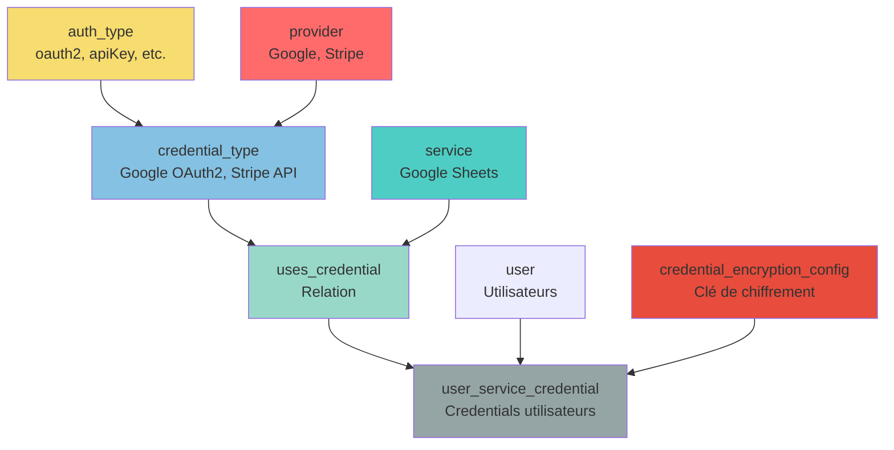

# 🔐 Module Credentials - Documentation Complète

## 📋 Vue d'ensemble

Ce module gère l'authentification et les credentials pour toutes les intégrations. Il suit une architecture similaire à n8n avec chiffrement automatique directement dans SurrealDB.

---

## 📂 Structure des Fichiers

### Tables (`database/credentials/`)
- `auth_type.surql` - Types d'authentification génériques (OAuth2, API Key, etc.)
- `credential_type.surql` - Types de credentials spécifiques par provider
- `transmission_method.surql` - Méthodes de transmission HTTP (header, query, body)
- `uses_credential.surql` - Relation service ↔ credential_type
- `user_service_credential.surql` - Credentials réels des utilisateurs (chiffrés)
- `credential_encryption_config.surql` - Configuration du chiffrement

### Seeds (`reference/credentials/`)
- `auth_type/` - Seeds pour auth_type
- `credential_type/` - Seeds pour credential_type (108 fichiers)
- `transmission_method/` - Seeds pour transmission_method
- `uses_credentials/` - Seeds pour les relations (14 batches)

### Fonctions (`resources/credentials/`)
- `auth_type/` - 5 fonctions pour auth_type
- `credential_type/` - 9 fonctions pour credential_type
- `transmission_method/` - 5 fonctions pour transmission_method
- `uses_credential/` - 7 fonctions pour uses_credential
- `user_service_credential/` - 8 fonctions pour user_service_credential
- `fn_encrypt_decrypt_credentials.surql` - Fonctions de chiffrement/déchiffrement

---

## 🏗️ Architecture

### Hiérarchie des Tables

```
auth_type (Référentiel)
    ↓ utilisé par
credential_type (Configuration par provider)
    ↓ lié par
uses_credential (Relation)
    ↓ à
service (Service qui utilise le credential)
    ↓ utilisé par
user_service_credential (Credentials réels des utilisateurs)
```

### Schéma Relationnel



---

## 📊 Tables Détaillées

### 1. `auth_type` - Types d'Authentification

**Objectif** : Référentiel des différents types d'authentification supportés.

**Types disponibles** :
- `oauth2` - OAuth 2.0 (le plus populaire)
- `oauth1` - OAuth 1.0a (legacy)
- `api_key` - Clé API simple
- `basic_auth` - Basic Authentication
- `bearer_token` - Token Bearer
- `digest_auth` - Digest Authentication
- `header_auth` - Header personnalisé
- `query_auth` - Query parameters
- `custom` - Authentification personnalisée

**Structure** :
- **Champs à plat** : `name`, `slug`, `is_active`
- **Groupés** : `identity`, `presentation`, `quality`, `config`, `http`, `behavior`, `documentation`

**Fonctions disponibles** :
- `fn::get_list_auth_type($langue_id, $user_id, $parent_run_id)`
- `fn::get_auth_type_for_ai($auth_type_id, $langue_id)`
- `fn::get_auth_type_config($auth_type_id, $langue_id)`
- `fn::get_auth_type_security($auth_type_id, $langue_id)`
- `fn::get_auth_type_with_etag($auth_type_id)`

---

### 2. `credential_type` - Types de Credentials

**Objectif** : Configuration spécifique des credentials pour chaque provider/service.

**Structure** :
- **Champs à plat** : `name`, `slug`, `is_active`, `auth_type`, `provider`
- **Groupés** : `identity`, `presentation`, `config`, `documentation`

**Relations** :
- `auth_type` → `auth_type` (type d'authentification)
- `provider` → `provider` (fournisseur, optionnel)

**Fonctions disponibles** :
- `fn::get_list_credential_type($langue_id)`
- `fn::get_credential_type_for_ai($credential_type_id, $langue_id)`
- `fn::get_credential_type_config($credential_type_id, $langue_id, $provider_id)`
- `fn::get_credential_type_by_provider($provider_id, $langue_id)`
- `fn::get_credential_type_generic($langue_id)`
- `fn::get_credential_type_security($langue_id)`
- `fn::get_credential_type_by_auth_type($auth_type_id)`
- `fn::get_credential_type_stats()`
- `fn::get_credential_type_with_etag($credential_type_id)`

---

### 3. `transmission_method` - Méthodes de Transmission

**Objectif** : Définit comment les credentials sont transmis via HTTP (header, query, body, custom).

**Méthodes disponibles** :
- `header` - Dans les headers HTTP (recommandé)
- `query` - Dans les paramètres de requête URL
- `body` - Dans le corps de la requête
- `custom` - Méthode personnalisée

**Structure** :
- **Champs à plat** : `name`, `slug`, `is_active`
- **Groupés** : `identity`, `presentation`, `quality`, `config`

**Fonctions disponibles** :
- `fn::get_list_transmission_method($langue_id)`
- `fn::get_transmission_method_for_ai($method_id, $langue_id)`
- `fn::get_transmission_method_security($langue_id)`
- `fn::get_transmission_method_recommended($langue_id, $include_all)`
- `fn::get_transmission_method_with_etag($method_id)`

---

### 4. `uses_credential` - Relation Service ↔ Credential

**Objectif** : Lie un service à un ou plusieurs types de credentials qu'il peut utiliser.

**Type** : `TYPE RELATION SCHEMAFULL`

**Structure** :
- **Relation** : `in` (service) → `out` (credential_type)
- **Champs** : `is_required`, `presentation`, `config`, `documentation`

**Cas d'usage** :

**Service avec un seul credential** :
```surql
service:stripe -> uses_credential -> credential_type:stripe_api
```

**Service avec plusieurs options** :
```surql
service:google_sheets -> uses_credential -> credential_type:google_oauth2 (recommandé)
                      -> uses_credential -> credential_type:google_service_account (alternatif)
```

**Fonctions disponibles** :
- `fn::get_service_credentials($service_id, $langue_id)`
- `fn::get_service_recommended_credential($service_id, $langue_id)`
- `fn::get_services_by_credential_type($credential_type_id, $langue_id)`
- `fn::get_credential_type_stats()`
- `fn::get_service_credentials_full($service_id, $langue_id)`
- `fn::get_credentials_by_complexity($complexity, $service_id, $langue_id)`
- `fn::get_uses_credential_with_etag($relation_id)`

---

### 5. `user_service_credential` - Credentials Utilisateurs

**Objectif** : Stocke les credentials réels des utilisateurs pour chaque service. **Chiffrement automatique** (comme n8n).

**Structure** :
- **Champs à plat** : `user_id`, `service_id`, `credential_type_id`, `is_active`, `expires_at`, `etag`
- **Groupés** : `identity`, `credentials` (chiffré), `metadata`

**Types de credentials supportés** :
- `credentials.oauth2` - OAuth2 tokens (access_token, refresh_token)
- `credentials.api_key` - Clés API
- `credentials.basic_auth` - Username/Password
- `credentials.custom` - Types personnalisés

**Fonctions disponibles** :
- `fn::create_user_service_credential(...)` - Crée avec chiffrement automatique
- `fn::update_user_service_credential(...)` - Met à jour avec chiffrement automatique
- `fn::delete_user_service_credential($credential_id, $hard_delete)`
- `fn::get_user_service_credential($user_id, $service_id, $langue_id)` - Sans données sensibles
- `fn::get_user_service_credential_decrypted($credential_id)` - Avec données déchiffrées
- `fn::get_user_credentials($user_id, $include_inactive, $langue_id)`
- `fn::get_expired_credentials($refresh_buffer_hours, $user_id)`
- `fn::get_user_service_credential_with_etag($credential_id)`

---

### 6. `credential_encryption_config` - Configuration Chiffrement

**Objectif** : Stocke la configuration de chiffrement pour les credentials (comme n8n).

**Champs** :
- `is_active` - Configuration active
- `algorithm` - Algorithme (`aes256`, `aes128`)
- `encryption_key` - Clé de chiffrement (minimum 32 caractères)
- `key_version` - Version de la clé (pour rotation)

**Fonctions de chiffrement** :
- `fn::encrypt_credential_value($plaintext)` - Chiffre une valeur
- `fn::decrypt_credential_value($encrypted_data, $key_version)` - Déchiffre une valeur
- `fn::encrypt_credentials_object($credentials)` - Chiffre un objet complet
- `fn::decrypt_credentials_object($encrypted_credentials)` - Déchiffre un objet complet

---

## 🔐 Chiffrement Automatique

Le système utilise un chiffrement automatique directement dans SurrealDB, similaire à n8n.

**Voir** : [ENCRYPTION_GUIDE.md](./ENCRYPTION_GUIDE.md) pour la documentation complète.

### Flux de chiffrement

1. **Création** : `fn::create_user_service_credential` chiffre automatiquement avant stockage
2. **Mise à jour** : `fn::update_user_service_credential` chiffre automatiquement avant stockage
3. **Récupération** : `fn::get_user_service_credential_decrypted` déchiffre automatiquement

### Champs chiffrés automatiquement

- ✅ `credentials.oauth2.access_token`
- ✅ `credentials.oauth2.refresh_token`
- ✅ `credentials.api_key.key`
- ✅ `credentials.basic_auth.username`
- ✅ `credentials.basic_auth.password`
- ✅ Tous les champs de `credentials.custom`

---

## 🔄 WebSocket et Temps Réel

Toutes les tables supportent les mises à jour en temps réel via WebSocket.

**Voir** : `../webhook/WEBSOCKET_CREDENTIALS.md` pour la documentation complète.

**Fonctionnalités** :
- ETag automatique (UUID v7) pour détecter les changements
- Support WebSocket via `LIVE SELECT`
- Optimistic locking pour éviter les conflits

---

## 📚 Seeds et Données de Référence

### Structure des Seeds

```
reference/credentials/
├── auth_type/
│   ├── auth_type_seeds.surql
│   ├── auth_type_i18n_keys.surql
│   └── auth_type_i18n_translations.surql
├── credential_type/
│   └── [108 fichiers batch]
├── transmission_method/
│   ├── transmission_method_seeds.surql
│   ├── transmission_method_i18n_keys.surql
│   └── transmission_method_i18n_translations.surql
└── uses_credentials/
    ├── uses_credential_batch1_seeds.surql à batch14_seeds.surql
    ├── uses_credential_i18n_keys.surql
    └── uses_credential_i18n_translations.surql
```

### Statistiques

- **auth_type** : 9 types d'authentification
- **credential_type** : 419 types de credentials (108 batches)
- **transmission_method** : 4 méthodes de transmission
- **uses_credential** : 419 relations (14 batches)

### Seeds `uses_credential`

**Format des relations** :

```surql
RELATE service:airtable->uses_credential->credential_type:airtable_oauth2_api SET
    is_required = true,
    presentation = {
        display_order: 1,
        is_recommended: true,
        badge_color_type: theme_color_type:primary
    },
    config = {
        custom_description_i18n: i18n_key:uses_cred_airtable_oauth2_desc,
        scopes_required: ["data.records:read", "data.records:write"],
        setup_complexity: "easy",
        estimated_setup_time: 5,
        use_case: "standard"
    };
```

**Champs principaux** :
- `is_required` : `true` = obligatoire, `false` = optionnel
- `presentation.display_order` : Ordre d'affichage (plus petit = premier)
- `presentation.is_recommended` : Badge "Recommandé" dans l'UI
- `presentation.badge_color_type` : Référence vers `theme_color_type` (primary, neutral, warning, error)
- `config.setup_complexity` : `easy`, `medium`, `hard`
- `config.estimated_setup_time` : Temps en minutes
- `config.use_case` : `standard`, `automation`, `serverless`, `development`, `production`

**Import des seeds** :

```bash
# Importer tous les batches uses_credential
for i in {1..14}; do
  surreal import --conn http://localhost:8000 \
    --user root --pass root \
    --ns lyxal --db lyxal \
    uses_credential_batch${i}_seeds.surql
done
```

---

## 🚀 Utilisation

### Créer une credential (chiffrement automatique)

```surql
LET $result = fn::create_user_service_credential(
    $user_id: 'user123',
    $service_id: 'service:google_sheets',
    $credential_type_id: 'credential_type:google_sheets_oauth2',
    $identity_name: 'Mon compte Google Sheets',
    $credentials: {
        oauth2: {
            access_token: 'ya29.a0AfH6SMB...',
            refresh_token: '1//0gX...',
            token_type: 'Bearer',
            expires_at: <datetime>'2024-12-31T23:59:59Z',
            scope: 'read:user write:message'
        }
    }
);
```

### Récupérer les credentials d'un service

```surql
LET $credentials = fn::get_service_credentials(
    $service_id: 'service:google_sheets',
    $langue_id: 'fr'
);
```

### Récupérer une credential déchiffrée (pour utilisation)

```surql
LET $credential = fn::get_user_service_credential_decrypted(
    $credential_id: 'user_service_credential:123'
);

-- Utiliser le token déchiffré
LET $access_token = $credential.credential.credentials.oauth2.access_token;
```

---

## 📖 Documentation Complémentaire

- **[ENCRYPTION_GUIDE.md](./ENCRYPTION_GUIDE.md)** - Guide complet du chiffrement automatique
- **[../webhook/WEBSOCKET_CREDENTIALS.md](../webhook/WEBSOCKET_CREDENTIALS.md)** - Documentation WebSocket et temps réel

---

**Dernière mise à jour** : 2025-01-27  
**Version** : 2.0
