# 📊 Diagrammes d'Architecture

Ce document contient des diagrammes visuels pour mieux comprendre l'architecture du module d'intégration.

---

## 🏗️ Vue d'ensemble : Hiérarchie Complète

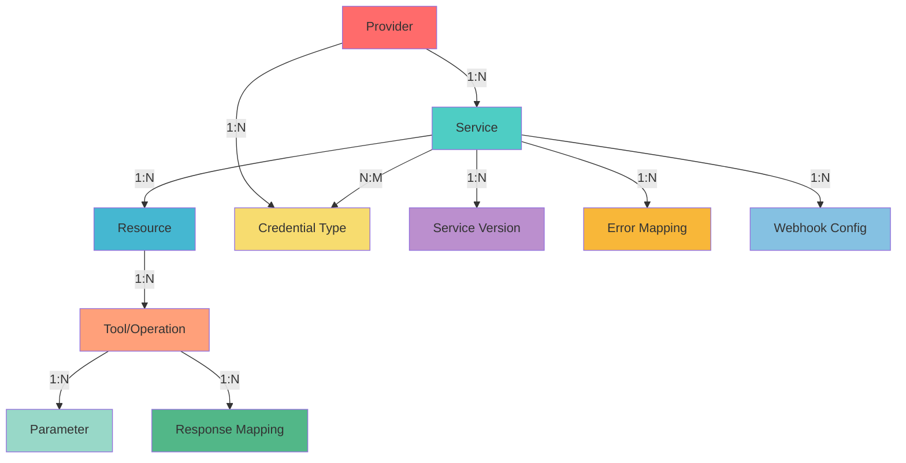

---

## 📦 Structure Core : Provider → Parameter

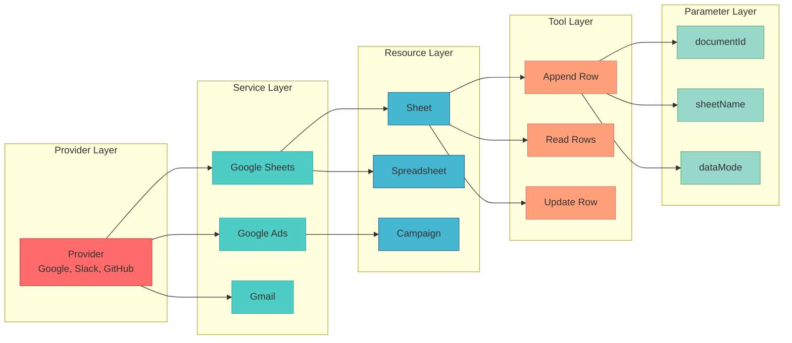

---

## 🔐 Système d'Authentification

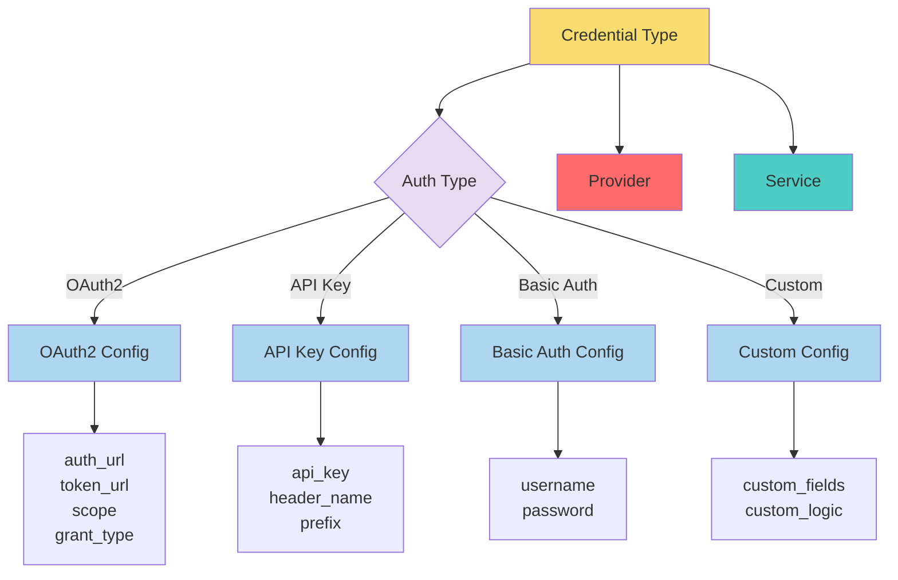

---

## 🎣 Système de Webhooks

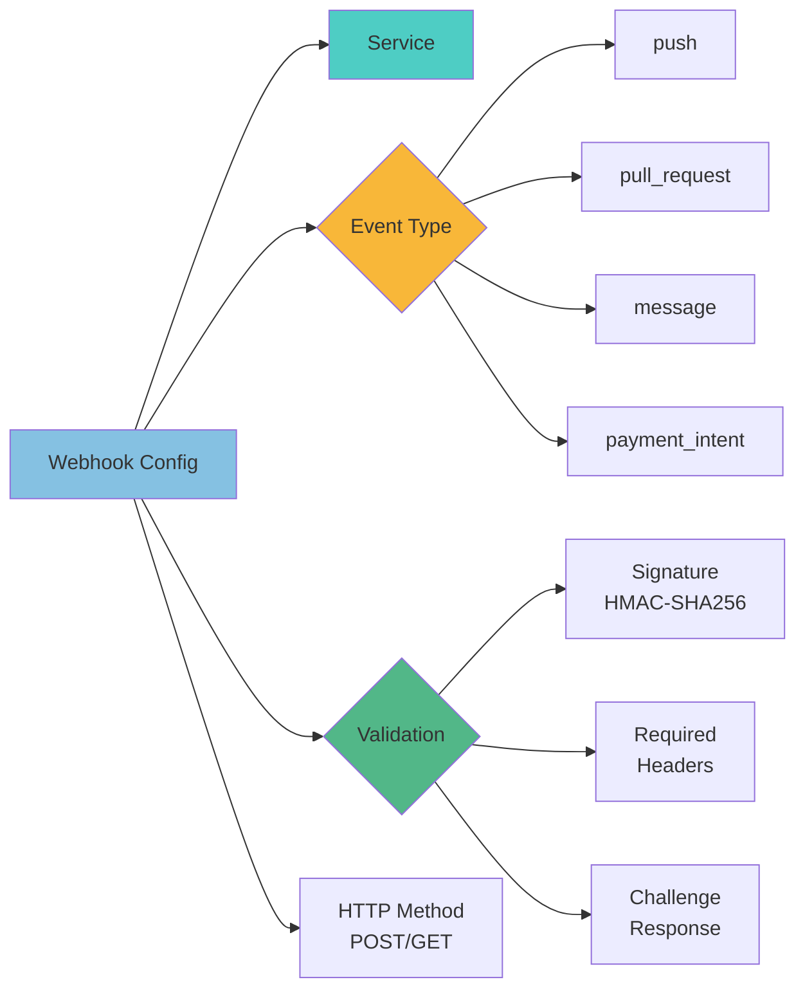

---

## 🔄 Gestion des Versions

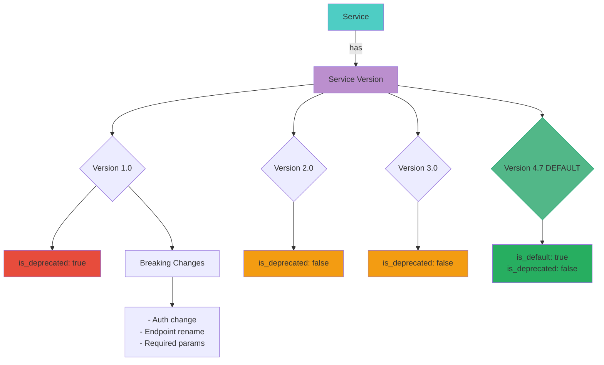

---

## ⚠️ Gestion des Erreurs

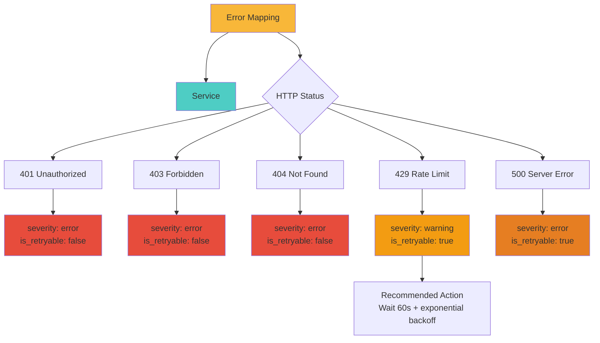

---

## 📊 Exemple Complet : Google Sheets

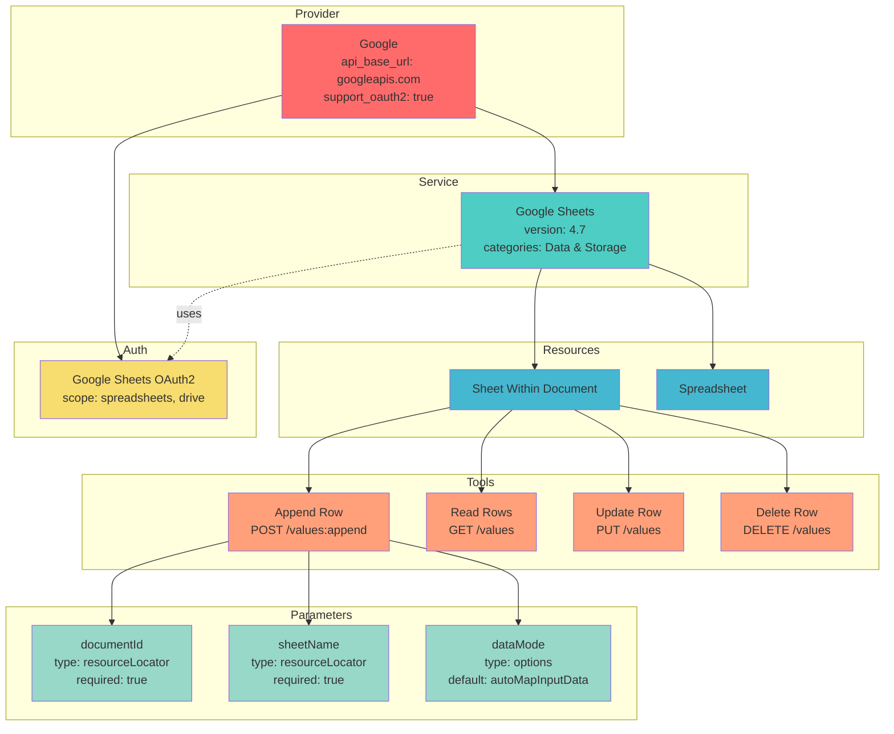

---

## 🌐 Exemple Complet : Slack

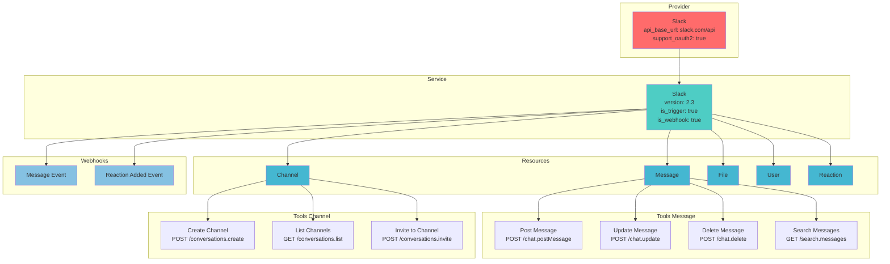

---

## 🎨 Types de Paramètres

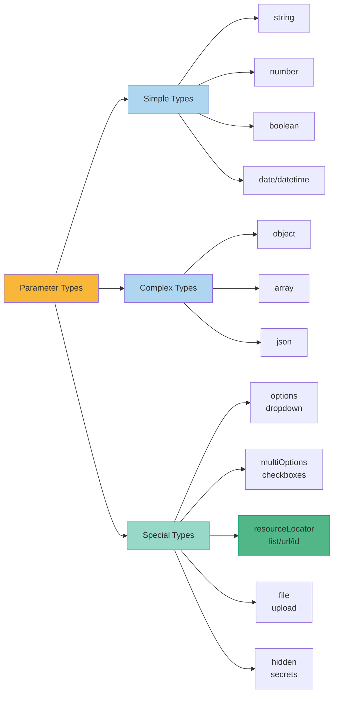

---

## 🔄 Resource Locator Pattern

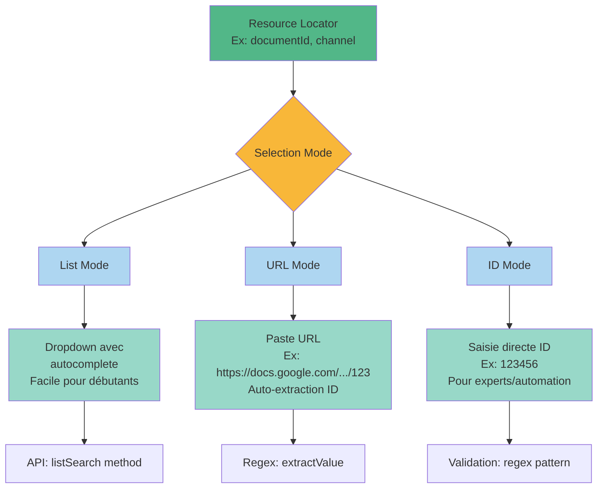

---

## 📈 Flow : Exécution d'un Tool

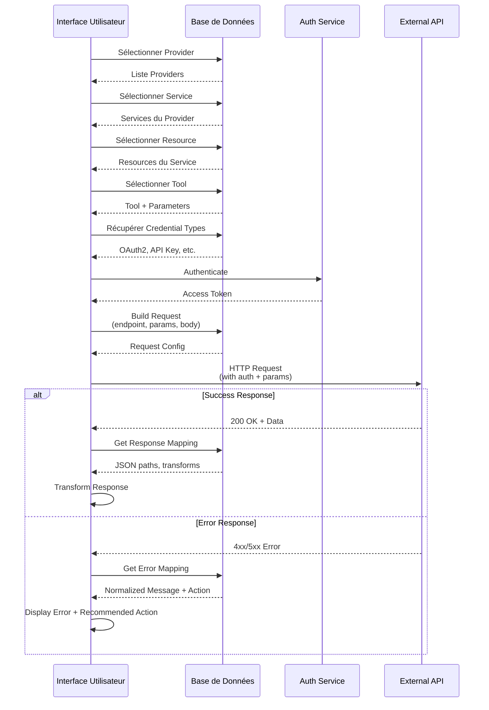

---

## 🎯 Pattern : Single Service vs Multi Service

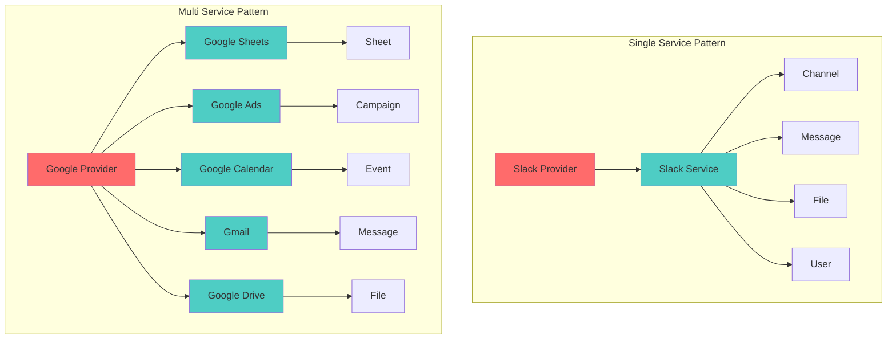

---

## 🔍 Data Flow : Query Construction

```mermaid
flowchart TD
    START([User Selects Tool]) --> A[Fetch Tool Details]
    A --> B[Fetch Parameters]
    B --> C[Fetch Resource Info]
    C --> D[Fetch Service Info]
    D --> E[Fetch Provider Info]
    E --> F[Fetch Credentials]
    
    F --> G{Build Request}
    
    G --> H[Interpolate Endpoint<br/>Replace {variables}]
    H --> I[Add Auth Headers/Params]
    I --> J[Build Request Body<br/>from parameters]
    J --> K[Apply Rate Limiting]
    
    K --> L{Execute Request}
    
    L -->|Success| M[Get Response Mapping]
    M --> N[Transform Response<br/>Using JSON Paths]
    N --> O[Return Formatted Data]
    
    L -->|Error| P[Get Error Mapping]
    P --> Q{Is Retryable?}
    Q -->|Yes| R[Retry with Backoff]
    R --> L
    Q -->|No| S[Return Normalized Error]
    
    O --> END([Complete])
    S --> END
    
    style START fill:#52b788
    style G fill:#f8b739
    style L fill:#f8b739
    style Q fill:#f39c12
    style END fill:#52b788
```

---

## 📊 Architecture Modulaire

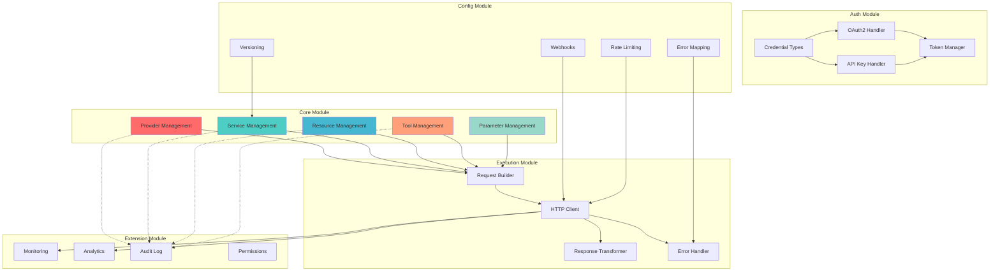

---

## 🎓 Exemple Use Case : Workflow Complet

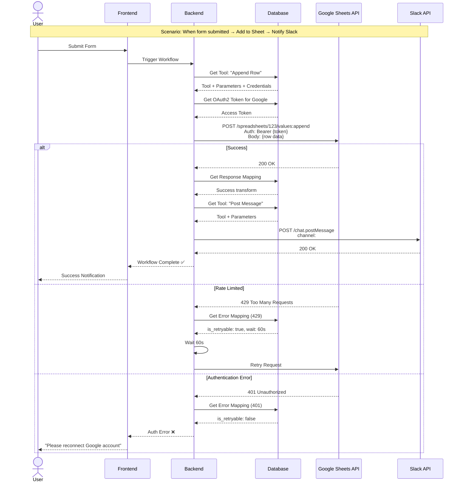

---

## 🎯 Conclusion

Ces diagrammes illustrent :

✅ **Hiérarchie claire** : Provider → Service → Resource → Tool → Parameter  
✅ **Modularité** : Chaque composant a sa responsabilité  
✅ **Flexibilité** : Support de multiples patterns (auth, webhooks, versioning)  
✅ **Robustesse** : Gestion d'erreurs, retry logic, rate limiting  
✅ **Scalabilité** : Architecture extensible avec metadata

Cette architecture est prête pour supporter **n'importe quel provider** avec **n'importe quel type d'API**.

---

**Note** : Ces diagrammes sont en format Mermaid et peuvent être visualisés dans :
- GitHub/GitLab (rendu automatique)
- VS Code (avec extension Mermaid)
- Documentation sites (MkDocs, Docusaurus, etc.)
- Outils dédiés (Mermaid Live Editor)

