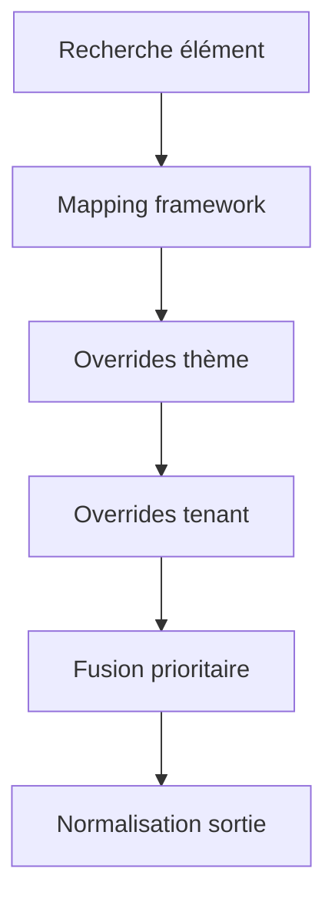

# 🏗️ ARCHITECTURE SYSTÈME DE MAPPING CSS RELATIONNEL

## 🎯 VISION GLOBALE

**Système Database-Driven de mapping CSS inspiré des icônes** qui élimine complètement les adaptateurs TypeScript et permet une flexibilité totale pour tous les frameworks CSS.

---

## 🏛️ ARCHITECTURE À 4 COUCHES

### **1. Couche Dictionnaire** 📚
**css_dictionary** - Éléments CSS de base indépendants du framework
```
🎨 Éléments sémantiques : primary_button, input_field, card_container
📋 Styles de base : display, cursor, transitions
📱 Responsive : mobile, desktop
🎭 Sémantique : action, input, container
```

### **2. Couche Framework** 🔧
**css_framework_mapping** - Traduction vers chaque framework
```
🎯 Mapping élément ↔ framework
📦 Classes framework : ["btn", "btn-primary"] (Bootstrap)
🎨 CSS personnalisé : variables, styles spécifiques
🎪 Support multi-framework : Tailwind, Bootstrap, Material
```

### **3. Couche Thème** 🎨
**css_theme_mapping** - Personnalisation par thème
```
🏢 White-Label : overrides par tenant
🎭 Personnalisation : dégradés, ombres spéciales
⏰ Temporaire : campagnes marketing
🎯 Priorisation : gestion des conflits
```

### **4. Couche Résolution** ⚙️
**fn::resolve_css_classes()** - Assemblage automatique
```
🔍 Recherche intelligente : framework + thème + tenant
🔄 Fusion automatique : base + overrides
📤 Sortie normalisée : classes + CSS + responsive
⚡ Cache optimisé : performances maximales
```

---

## 🔄 FLUX DE RÉSOLUTION

### **Entrée**
```javascript
const result = await db.query(`
  SELECT fn::resolve_css_classes($element, $framework, $theme, $tenant)
`, {
  element: "primary_button",
  framework: "tailwind",
  theme: "corporate",
  tenant: "client_xyz"
});
```

### **Traitement Interne**


### **Sortie**
```json
{
  "element_code": "primary_button",
  "framework": "tailwind",
  "all_classes": ["bg-blue-800", "text-white", "shadow-lg"],
  "custom_css": "box-shadow: 0 4px 6px rgba(0,0,0,0.1);",
  "responsive": { "mobile": "...", "desktop": "..." }
}
```

---

## 🎯 CAS D'USAGE CONCRETS

### **1. Ajout Nouveau Framework** 🚀
```surql
-- Étape 1 : Créer mappings pour tous les éléments existants
CREATE css_framework_mapping:primary_button_bulma SET
  css_element = css_dictionary:primary_button,
  framework = "bulma",
  mapping = {
    classes = ["button", "is-primary", "is-medium"]
  };

CREATE css_framework_mapping:input_field_bulma SET
  css_element = css_dictionary:input_field,
  framework = "bulma",
  mapping = {
    classes = ["input", "is-medium"]
  };

-- Étape 2 : Mettre à jour la config tenant
UPDATE studio_config:my_tenant SET
  css_framework = "bulma";

-- Résultat : Changement instantané sans redéploiement !
```

### **2. White-Label Spécifique** 🏢
```surql
-- Override bouton pour client spécifique
CREATE css_theme_mapping:primary_button_client_xyz SET
  css_element = css_dictionary:primary_button,
  theme = studio_theme:default_light,
  overrides = {
    custom_css = "
      background: linear-gradient(135deg, #ff6b35 0%, #f7931e 100%);
      color: white;
      border: none;
      font-weight: bold;
    "
  },
  conditions = {
    tenant_ids = ["client_xyz"]
  },
  metadata = {
    priority = 20,
    business_reason = "Charte graphique orange client XYZ"
  };
```

### **3. Campagne Marketing Temporaire** 🎪
```surql
-- Bouton spécial Noël
CREATE css_theme_mapping:button_christmas SET
  css_element = css_dictionary:primary_button,
  theme = studio_theme:default_light,
  overrides = {
    additional_classes = ["animate-bounce"],
    custom_css = "
      background: #d42426;
      color: white;
      position: relative;
    ",
    custom_css_after = "
      content: '🎄';
      position: absolute;
      right: -20px;
      top: -10px;
    "
  },
  metadata = {
    priority = 15,
    description = "Bouton spécial Noël avec sapin animé",
    business_reason = "Campagne marketing saisonnière",
    expires_at = "2024-01-01T00:00:00Z"  // Auto-expiration
  };
```

---

## ⚡ PERFORMANCES & OPTIMISATION

### **Cache Intelligent** 🧠
```typescript
// Hook avec cache automatique
const useCssClasses = (elementCode) => {
  return useQuery({
    queryKey: ['css-classes', elementCode, framework, theme, tenant],
    staleTime: 5 * 60 * 1000, // 5 minutes
    cacheTime: 30 * 60 * 1000, // 30 minutes
  });
};
```

### **LIVE QUERY pour Changements Temps Réel** 📡
```typescript
// Écoute changements de thème
const liveQuery = await db.live(
  `SELECT css_framework FROM studio_config WHERE tenant_id = $tenant`,
  (update) => {
    if (update.result?.css_framework) {
      // Rechargement automatique des classes
      invalidateCssCache();
    }
  }
);
```

### **Bundle Splitting** 📦
```typescript
// Chargement lazy des mappings
const loadFrameworkMappings = async (framework) => {
  return import(`./mappings/${framework}.json`);
};
```

---

## 🔒 SÉCURITÉ & VALIDATION

### **Validation Automatique** ✅
```surql
-- Vérifier intégrité mapping
SELECT fn::validate_css_mapping("primary_button", "tailwind");

-- Résultat :
{
  valid: true,
  classes_count: 8,
  has_custom_css: true,
  has_responsive: true
}
```

### **Audit Trail** 📊
```surql
-- Historique modifications
SELECT * FROM css_framework_mapping
WHERE metadata.updated_at > time::now() - 7d
ORDER BY metadata.updated_at DESC;
```

### **Permissions Granulaires** 🔐
```surql
-- Administrateur global
DEFINE ACCESS admin ON DATABASE TYPE EDIT;

-- Éditeur tenant
DEFINE ACCESS tenant_editor ON DATABASE TYPE EDIT
  WHERE tenant_id = $auth.tenant_id;

-- Lecture seule
DEFINE ACCESS viewer ON DATABASE TYPE READ;
```

---

## 🚀 ÉVOLUTION & EXTENSIBILITÉ

### **Nouveaux Frameworks** 🌍
- **Ajouter framework** = Créer mappings en DB
- **Zero downtime** = Activation instantanée
- **Test isolé** = Validation avant activation

### **Nouveaux Éléments** 🆕
- **Créer élément** = `CREATE css_dictionary`
- **Mappings automatiques** = Scripts de génération
- **Validation communautaire** = PR pour nouveaux éléments

### **IA & Automatisation** 🤖
- **Génération mappings** = IA analyse frameworks
- **Optimisation automatique** = A/B testing classes
- **Migration assistée** = Conversion DaisyUI → mappings

---

## 📊 MÉTRIQUES DE SUCCÈS

### **Performance** ⚡
- **Temps résolution** : < 10ms (cache DB)
- **Bundle size** : -30% vs DaisyUI
- **Loading time** : -20% (CSS pur)

### **Maintenabilité** 🔧
- **Ajout framework** : 2h (mappings DB)
- **Modification thème** : 5min (UPDATE DB)
- **Déploiement** : 0 (Database-Driven)

### **Flexibilité** 🎨
- **Frameworks supportés** : ∞ (vs 33 DaisyUI)
- **White-Label** : ∞ combinaisons
- **Personnalisation** : Granulaire par élément

---

## 🎯 CONCLUSION

**Cette architecture révolutionne l'approche CSS dans Lyxal Studio :**

### **Avant (DaisyUI)** ❌
- 33 thèmes fixes
- Changement = redéploiement
- Framework unique
- Maintenance lourde

### **Après (Mapping Relationnel)** ✅
- ∞ thèmes dynamiques
- Changement = UPDATE DB
- Multi-framework natif
- Maintenance simplifiée

**Database-Driven CSS ultime !** 🎨⚡🚀

---

*Architecture conçue pour l'évolutivité maximale et la flexibilité totale*
