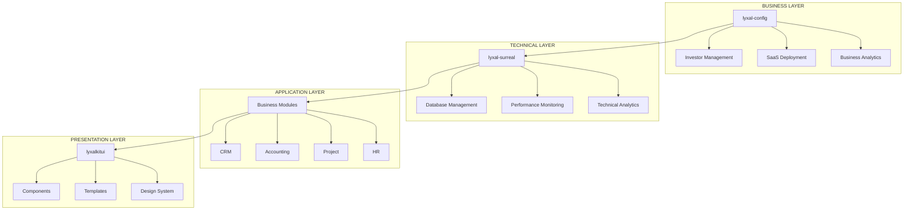

# 📚 Lyxal Suite - Documentation Complète

*Plateforme SaaS Multi-Tenant de Niveau Enterprise avec IA Intégrée*

## 🎯 Vue d'ensemble

**Lyxal Suite** est une plateforme SaaS multi-tenant révolutionnaire permettant aux **investors indépendants** de déployer et gérer leurs propres écosystèmes SaaS avec une isolation totale, une intelligence artificielle intégrée, et une scalabilité illimitée.

## 🏗️ Architecture Globale



---

## 📚 Navigation de la Documentation

### 🏛️ Architecture
- **[LyxalSurreal Gateway](./lyxal-gateway-overview.md)** - Module central et Gateway SurrealDB multi-tenant
- **[Module Lyxal Config](./LYXAL-CONFIG-MODULE.md)** - Documentation du module de déploiement et configuration
- **[Référence Architecturale](./architecture/architecture-reference.md)** - Référence complète des niveaux INVESTOR/DEVELOPER
- **[Backend Modules](./architecture/core/backend-modules.md)** - Architecture des modules backend
- **[Multi-tenancy](./architecture/core/multi-tenancy.md)** - Gestion multi-tenant
- **[Stratégie Monitoring](./architecture/core/monitoring-strategy.md)** - Monitoring native SurrealDB
- **[Architecture LyxalAuth](./architecture/core/lyxalauth-architecture.md)** - Architecture hexagonale d'authentification

### 🚀 Modules Principaux

#### Couche Déploiement
- **[Lyxal Config](./LYXAL-CONFIG-MODULE.md)** - Module de déploiement et configuration des investors

#### Couche Technique  
- **[Lyxal Surreal - Guide](./modules/lyxal-surreal-guide.md)** - Guide d'utilisation et installation
- **[Lyxal Surreal - API](./modules/lyxal-surreal-api.md)** - Référence API bicéphale complète
- **[Lyxal Surreal - API Basic](./modules/lyxal-surreal-api-basic.md)** - API de base

#### Couche Authentification
- **[LyxalAuth - Guide](./modules/lyxalauth-guide.md)** - Guide d'utilisation architecture hexagonale
- **[LyxalAuth - Spécifications](./modules/lyxalauth-specs.md)** - Spécifications techniques détaillées
- **[LyxalAuth - Gateway](./modules/lyxalauth/gateway/)** - Documentation gateway complète

#### Couche Infrastructure
- **[Lyxal Base](./modules/lyxal-base/)** - 24 entités fondamentales IA-native |

### 💼 Modules Métier
- **[Lyxal CRM](./modules/lyxalcrm.md)** - Gestion relation client
- **Lyxal Accounting** - Comptabilité et facturation
- **Lyxal Project** - Gestion de projets
- **Lyxal HR** - Ressources humaines
- **Lyxal Inventory** - Gestion des stocks
- **Lyxal Marketing** - Marketing automation

### 🎨 Interface Utilisateur
- **[Lyxal Kit UI](./frontend/lyxalkitui.md)** - Bibliothèque de composants
- **[Templates](./frontend/templates.md)** - Templates par industrie
- **[Déploiement Frontend](./frontend/deployment.md)** - Guide de déploiement

### 🗄️ Base de Données
- **[Structure SurrealDB](./database/surrealdb-structure.md)** - Architecture de données
- **[Architecture DataTables](./architecture/concepts/datatables-configurables.md)** - Documentation technique
- **[Guide Pratique DataTables](./guides/datatables-guide-pratique.md)** - Guide d'utilisation

### 🔧 Développement
- **[Processus Création Module](./development/module-creation-process.md)** - Comment créer un module
- **[Template Module](./development/module-template.md)** - Template de base
- **[Setup MCP SurrealDB](./development/mcp-surrealdb-setup.md)** - Configuration développement
- **[Roadmap Provisioning](./development/roadmap-provisioning.md)** - Feuille de route
- **[Notes Migration Frontend](./development/frontend-migration-notes.md)** - Migration composants frontend
- **[Roadmap LyxalAuth](./development/lyxalauth-roadmap.md)** - Plan d'action LyxalAuth

### 🏢 Business
- **[Pricing](./business/pricing.md)** - Modèle de tarification

### 🔐 Authentification
- **[Setup Logto](./auth/logto-setup.md)** - Configuration authentification

### 🌐 SaaS Builder
- **[Overview](./saas-builder/overview.md)** - Vue d'ensemble du SaaS Builder
- **[Multi-Domain Deployment](./saas-builder/multi-domain-deployment.md)** - Déploiement multi-domaines

---

## 🚀 Démarrage Rapide

### 1. Installation
```bash
git clone https://github.com/lyxal/lyxal-suite.git
cd lyxal-suite/lyxalsuite
npm install
```

### 2. Configuration SurrealDB
```bash
# Démarrer SurrealDB
surreal start --log trace --user admin --pass admin

# Déployer la structure lyxal-config
cd lyxal-config
surreal sql --conn http://localhost:8000 --user admin --pass admin \
  --ns LYXAL_CONFIG --db production \
  < database/investor_config_structure.surql
```

### 3. Déployer un Investor
```typescript
import { InvestorDeploymentService, RESTAURANT_INVESTOR_CONFIG } from '@lyxal/config';

const deploymentService = new InvestorDeploymentService();
const result = await deploymentService.deployNewInvestor(RESTAURANT_INVESTOR_CONFIG);

console.log('Investor déployé:', result.investor_id);
```

### 4. Monitoring
```typescript
import { SurrealClient } from '@lyxal/surreal';

const client = new SurrealClient({
  url: result.backend_url,
  namespace: 'RESTAURANT_CHAIN'
});

await client.startMonitoring();
```

---

## 🎯 Concepts Clés

### Investors Indépendants
Chaque **investor** possède :
- ✅ **Backend SurrealDB privé** avec credentials uniques
- ✅ **Namespace dédié** (ex: `RESTAURANT_CHAIN`, `LEGAL_FIRM`)
- ✅ **Isolation totale** - aucune visibilité croisée
- ✅ **SaaS multiples** pour leurs propres clients

### Architecture Bicéphale
```
INVESTOR_LEVEL (Business)
├── Gestion des investors
├── Déploiement SaaS
└── Analytics business

DEVELOPER_LEVEL (Technique)  
├── Monitoring technique
├── Optimisation performance
└── Gestion infrastructure
```

### Intelligence Artificielle Native
```sql
-- Fonctions IA intégrées dans SurrealDB
SELECT fn::investor_health_score('investor-123');
SELECT fn::predict_growth('investor-123');
SELECT fn::optimize_resources('investor-123');
SELECT fn::detect_anomalies('investor-123');
```

---

## 🏢 Types d'Industries Supportées

### 🍽️ Restaurant & Hospitality
```typescript
const restaurantConfig = {
  modules: ['lyxal-crm', 'lyxal-accounting', 'lyxal-inventory'],
  features: ['pos_integration', 'reservation_system', 'food_cost_analysis']
};
```

### ⚖️ Legal & Professional Services
```typescript
const legalConfig = {
  modules: ['lyxal-crm', 'lyxal-project', 'lyxal-accounting'],
  features: ['case_management', 'document_templates', 'legal_billing']
};
```

### 🛒 E-commerce & Retail
```typescript
const ecommerceConfig = {
  modules: ['lyxal-crm', 'lyxal-inventory', 'lyxal-marketing'],
  features: ['customer_segmentation', 'stock_alerts', 'payment_integration']
};
```

---

## 📊 Statut des Modules

| Module | Statut | Description |
|--------|--------|-------------|
| **lyxal-config** | ✅ **TERMINÉ** | Module de déploiement et configuration |
| **lyxal-surreal** | ✅ **TERMINÉ** | Monitoring technique et SurrealDB |
| **lyxal-base** | ✅ **TERMINÉ** | Fondations communes |
| **lyxalkitui** | ✅ **TERMINÉ** | Bibliothèque de composants UI |
| **lyxalauth** | 🟨 EN COURS | Module Authentification |
| **lyxalcrm** | 🔴 À FAIRE | Module CRM |
| **lyxal-accounting** | 🔴 À FAIRE | Module Comptabilité |
| **lyxal-project** | 🔴 À FAIRE | Module Gestion de projets |

---

## 🛡️ Sécurité Enterprise

### Isolation Multi-Niveaux
1. **Niveau Investor** : Namespace privé + backend dédié
2. **Niveau SaaS** : Database isolée par client
3. **Niveau Data** : Permissions RBAC granulaires
4. **Niveau Network** : Chiffrement TLS 1.3 bout-en-bout

### Conformité
- ✅ **GDPR** : Conformité native européenne
- ✅ **SOC 2 Type II** : Audit de sécurité
- ✅ **ISO 27001** : Management sécurité
- ✅ **HIPAA** : Données de santé (modules spécialisés)

---

## 📈 Performance Enterprise

### SLA Garantis
| Métrique | Valeur | Niveau |
|----------|--------|--------|
| **Uptime** | 99.99% | Enterprise |
| **Latence P95** | < 50ms | Excellent |
| **Throughput** | 100k req/sec | High Scale |
| **Recovery** | < 30 sec | Resilient |

### Scalabilité Illimitée
- **Investors** : Aucune limite
- **SaaS/Investor** : 10,000+
- **Users/SaaS** : 1M+
- **Data/Investor** : 100TB+

---

## 🔮 Roadmap 2024-2025

### Q2 2024 - Multi-Cloud Native
- [ ] **Kubernetes** : Orchestration cloud-native
- [ ] **Service Mesh** : Istio pour micro-services
- [ ] **Multi-région** : Déploiement géographique

### Q3 2024 - AI-First Platform
- [ ] **LLM Integration** : GPT-4 pour insights
- [ ] **AutoML** : Modèles ML automatiques
- [ ] **Natural Language** : Requêtes en langage naturel

### Q4 2024 - Edge & Quantum Ready
- [ ] **Edge Computing** : Déploiement edge global
- [ ] **Quantum Encryption** : Sécurité quantique
- [ ] **Blockchain Audit** : Audit immutable

---

## 🤝 Contribution

### Standards de Code
- **TypeScript** strict mode
- **Tests** : 95%+ coverage
- **Documentation** : JSDoc complète
- **Linting** : ESLint + Prettier
- **Security** : SAST/DAST validé

### Processus
1. **Fork** le repository
2. **Créer** une branche feature
3. **Développer** avec tests
4. **Documenter** les changements
5. **Pull Request** avec review

---

## 📞 Support

### Support Enterprise
- **24/7 Support** : Disponible pour clients enterprise
- **Dedicated Success Manager** : Support personnalisé
- **SLA Guarantees** : Engagements contractuels

### Communauté
- **Discord** : Communauté développeurs
- **GitHub Discussions** : Questions techniques
- **Monthly Webinars** : Formations et nouveautés

---

**Lyxal Suite** - Révolutionner le SaaS multi-tenant avec l'IA native et l'isolation totale. 🚀

*Documentation mise à jour en continu - Version actuelle : 1.0.0* 