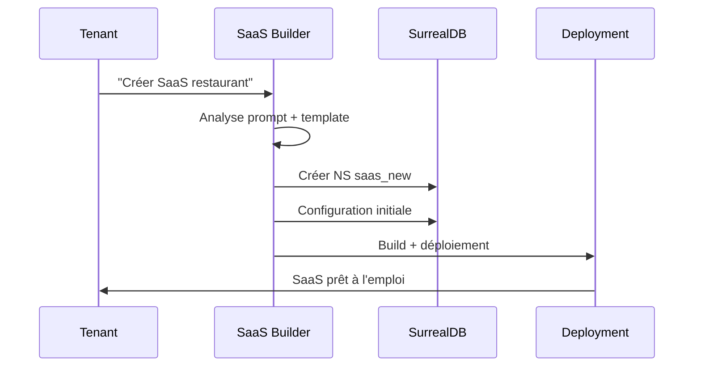
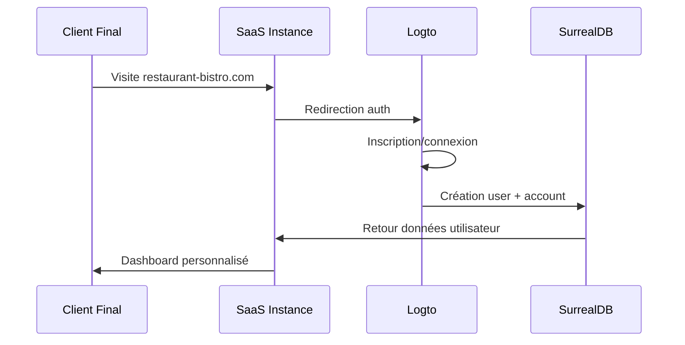
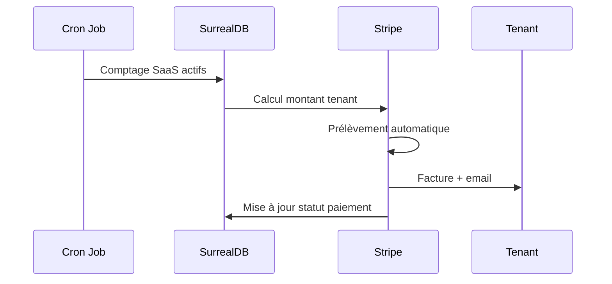

# 🏢 Architecture Multi-Tenant LyxalSuite

## 🎯 Vue d'ensemble

LyxalSuite implémente une architecture **multi-tenant B2B2C** où chaque **tenant** (freelance/agence) peut créer et gérer plusieurs **SaaS instances** pour ses clients finaux.

## 🏗️ Hiérarchie des entités

### Structure complète
```
🏪 LyxalSuite Platform
│
├── 👤 Tenant (Propriétaire SaaS)
│   ├── 📊 Plan & Billing
│   ├── 🏪 SaaS Instance 1
│   │   ├── 🏢 Account (Client final)
│   │   │   ├── 👥 Users
│   │   │   └── 🏢 Workspaces
│   │   │       ├── 📦 Modules activés
│   │   │       └── 💾 Données métier
│   │   └── ⚙️ Configuration SaaS
│   │
│   └── 🏪 SaaS Instance N
│       └── ... (même structure)
│
└── 🔄 Processus automatisés
    ├── Billing tenant
    ├── Déploiement SaaS
    └── Monitoring global
```

## 👤 Tenant (Propriétaire SaaS)

### Profil tenant
```json
{
  "id": "tenant_12345",
  "type": "freelance" | "agency",
  "profile": {
    "name": "FreelanceA",
    "email": "contact@freelancea.com",
    "company": "FreelanceA Solutions",
    "industry_focus": ["restaurant", "finance"]
  },
  "subscription": {
    "plan": "pro", // starter|pro|enterprise
    "price_base": 99,
    "price_per_saas": 29,
    "saas_limit": 10,
    "created_at": "2024-01-01T00:00:00Z"
  },
  "billing": {
    "active_saas_count": 3,
    "monthly_cost": 186, // 99 + (3 × 29)
    "next_billing": "2024-02-01T00:00:00Z",
    "payment_method": "stripe_card_xyz"
  }
}
```

### Plans tenant disponibles
```yaml
Plans:
  starter:
    price_base: €29/mois
    price_per_saas: €49/SaaS
    saas_limit: 3
    support: "community"
    
  pro:
    price_base: €99/mois
    price_per_saas: €29/SaaS
    saas_limit: 15
    support: "email"
    white_label: true
    
  enterprise:
    price_base: €299/mois
    price_per_saas: €19/SaaS
    saas_limit: 100
    support: "premium"
    white_label: true
    custom_domain: true
```

## 🏪 SaaS Instance

### Configuration SaaS
```json
{
  "id": "saas_67890",
  "tenant_id": "tenant_12345",
  "config": {
    "name": "Bistro Paris",
    "domain": "restaurant-bistro-paris.com",
    "industry": "restaurant",
    "template": "restaurant_v2",
    "branding": {
      "logo": "https://cdn.lyxal.com/logos/bistro-paris.png",
      "colors": {
        "primary": "#8B4513",
        "secondary": "#CD853F"
      },
      "fonts": {
        "heading": "Playfair Display",
        "body": "Open Sans"
      }
    }
  },
  "modules": {
    "enabled": ["auth", "crm", "ecommerce", "analytics"],
    "config": {
      "crm": {
        "features": ["customers", "reservations", "loyalty"],
        "limits": { "customers": 1000 }
      },
      "ecommerce": {
        "features": ["menu", "orders", "delivery"],
        "payment_gateways": ["stripe", "paypal"]
      }
    }
  },
  "deployment": {
    "status": "deployed",
    "url": "https://restaurant-bistro-paris.com",
    "build_version": "1.2.3",
    "deployed_at": "2024-01-15T10:30:00Z"
  }
}
```

### Templates par industrie
```yaml
Templates:
  restaurant:
    modules: [auth, crm, ecommerce, analytics]
    pages: [menu, orders, reservations, staff, analytics]
    roles: [admin, manager, staff, waiter]
    
  finance:
    modules: [auth, crm, analytics, ai]
    pages: [portfolio, clients, reports, ai-advisor]
    roles: [advisor, analyst, client]
    
  ecommerce:
    modules: [auth, crm, ecommerce, analytics, ai]
    pages: [products, orders, customers, inventory, marketing]
    roles: [owner, manager, support, customer]
    
  healthcare:
    modules: [auth, crm, analytics]
    pages: [patients, appointments, medical-records, billing]
    roles: [doctor, nurse, receptionist, patient]
```

## 🏢 Account (Client final)

### Structure account
```json
{
  "id": "account_abc123",
  "saas_id": "saas_67890",
  "profile": {
    "name": "Restaurant Bistro Paris",
    "owner": "Jean Dupont",
    "email": "jean@bistro-paris.com",
    "phone": "+33 1 23 45 67 89",
    "address": {
      "street": "15 rue de Rivoli",
      "city": "Paris",
      "postal_code": "75001",
      "country": "France"
    }
  },
  "subscription": {
    "plan": "premium", // plan défini par le tenant
    "features": ["reservations", "delivery", "loyalty"],
    "limits": {
      "users": 10,
      "orders_per_month": 1000,
      "storage_gb": 5
    }
  },
  "workspaces": ["ws_main", "ws_catering"]
}
```

## 👥 Users

### Hiérarchie utilisateurs
```json
{
  "id": "user_xyz789",
  "account_id": "account_abc123",
  "profile": {
    "email": "manager@bistro-paris.com",
    "first_name": "Marie",
    "last_name": "Martin",
    "role": "manager",
    "avatar": "https://cdn.lyxal.com/avatars/marie-martin.jpg"
  },
  "permissions": {
    "workspaces": ["ws_main"],
    "modules": {
      "crm": ["read", "write"],
      "analytics": ["read"],
      "ecommerce": ["read", "write"]
    },
    "resources": {
      "customers": ["*"],
      "orders": ["read", "update"],
      "menu": ["read"]
    }
  },
  "auth": {
    "logto_user_id": "logto_user_456",
    "last_login": "2024-01-20T14:30:00Z",
    "sessions": ["session_active_1"]
  }
}
```

### Rôles par industrie
```yaml
Restaurant:
  admin:
    permissions: ["*"]
    description: "Propriétaire/gérant principal"
    
  manager:
    permissions: ["crm.*", "analytics.read", "ecommerce.*"]
    description: "Manager opérationnel"
    
  staff:
    permissions: ["crm.customers.read", "ecommerce.orders.*"]
    description: "Personnel service"
    
  waiter:
    permissions: ["ecommerce.orders.read", "ecommerce.orders.update"]
    description: "Serveur"

Finance:
  advisor:
    permissions: ["*"]
    description: "Conseiller principal"
    
  analyst:
    permissions: ["analytics.*", "crm.read"]
    description: "Analyste financier"
    
  client:
    permissions: ["portfolio.read", "reports.read"]
    description: "Client final"
```

## 🏢 Workspaces 

### Structure workspace
```json
{
  "id": "ws_main",
  "account_id": "account_abc123",
  "name": "Restaurant Principal",
  "type": "production",
  "config": {
    "timezone": "Europe/Paris",
    "currency": "EUR",
    "language": "fr",
    "business_hours": {
      "monday": { "open": "11:00", "close": "23:00" },
      "tuesday": { "open": "11:00", "close": "23:00" },
      "sunday": "closed"
    }
  },
  "modules_data": {
    "crm": {
      "customers_count": 250,
      "last_sync": "2024-01-20T12:00:00Z"
    },
    "ecommerce": {
      "products_count": 45,
      "orders_today": 12
    }
  }
}
```

## 🗄️ Isolation des données

### SurrealDB Namespaces
```sql
-- Configuration globale
USE NS system;
  - tenants
  - saas_instances  
  - global_config
  - billing_data

-- Données tenant
USE NS tenant_12345;
  - tenant_config
  - saas_instances
  - billing_history
  - support_tickets

-- Données SaaS
USE NS saas_67890;
  - saas_config
  - accounts
  - users
  - workspaces

-- Données métier workspace  
USE NS ws_main;
  - customers
  - orders  
  - products
  - analytics_data
  - files_storage
```

### Règles d'isolation
```yaml
Accès aux données:
  tenant_level:
    - Tenant peut voir uniquement ses SaaS
    - Aucun accès aux données d'autres tenants
    
  saas_level:
    - SaaS peut voir uniquement ses accounts
    - Isolation complète entre SaaS du même tenant
    
  account_level:
    - Account peut voir uniquement ses workspaces
    - Utilisateurs limités à leur account
    
  workspace_level:
    - Données métier complètement cloisonnées
    - Accès selon permissions utilisateur
```

## 🔄 Processus multi-tenant

### 1. Création d'un nouveau SaaS


### 2. Onboarding client final


### 3. Facturation automatique


## 🛡️ Sécurité multi-tenant

### Guards middleware
```typescript
// SaasGuard - Validation accès SaaS
export class SaasGuard {
  async canActivate(context: ExecutionContext): Promise<boolean> {
    const request = context.switchToHttp().getRequest();
    const tenantId = request.user.tenant_id;
    const saasId = request.params.saas_id;
    
    return await this.tenantService.ownsSaas(tenantId, saasId);
  }
}

// WorkspaceGuard - Validation accès workspace
export class WorkspaceGuard {
  async canActivate(context: ExecutionContext): Promise<boolean> {
    const request = context.switchToHttp().getRequest();
    const userId = request.user.id;
    const workspaceId = request.params.workspace_id;
    
    return await this.userService.hasWorkspaceAccess(userId, workspaceId);
  }
}
```

### Validation des permissions
```typescript
// Vérification permissions granulaires
export class PermissionService {
  async checkPermission(
    userId: string, 
    resource: string, 
    action: string
  ): Promise<boolean> {
    const userPermissions = await this.getUserPermissions(userId);
    
    return userPermissions.some(permission => 
      permission.resource === resource && 
      permission.actions.includes(action)
    );
  }
}
```

---

**🏢 Architecture multi-tenant : Scalabilité + Sécurité + Isolation complète** 