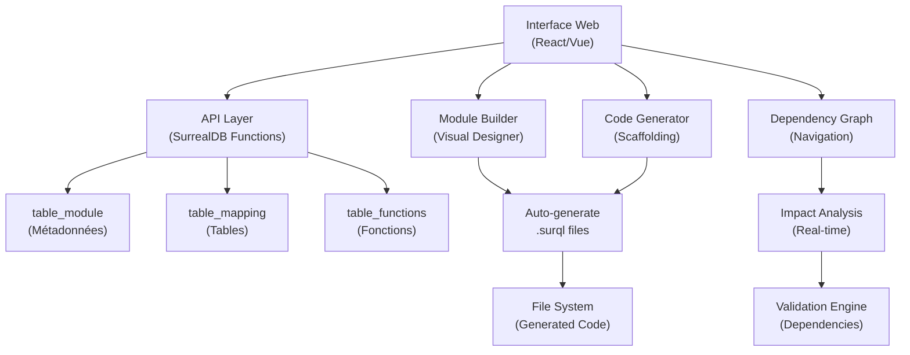

# 🚀 VISION : Interface de Développement basée sur Métadonnées

## 📋 Vue d'ensemble

Ce document présente la **vision révolutionnaire** d'une interface de développement complète basée sur le système de métadonnées `table_module`. Cette approche permet de transformer le développement traditionnel en un processus **visuel, assisté et automatisé**.

## 🎯 Concept Central

### **Principe fondamental** :
- **Métadonnées queryables** remplacent la documentation statique
- **Fonctions utilitaires** simplifient l'alimentation des données
- **Interface graphique** permet le développement visuel
- **Génération automatique** produit le code final

### **Objectif** :
Créer un **véritable IDE low-code** pour l'architecture SurrealDB qui permet de développer l'application depuis une interface web.

---

## 🏗️ Architecture du Système



---

## 🎨 Fonctionnalités de l'Interface

### **1. Module Builder Visuel**

#### Interface de création de modules :
```
┌─ Module Builder ─────────────────────────────────┐
│ Nom: [Customer Relationship Management]          │
│ Code: [CRM]                                      │
│ Tags: [☑ Business] [☑ CRUD] [☐ Analytics]       │
│                                                  │
│ Dépendances:                                     │
│ ┌─ Tables ─────┐  ┌─ Fonctions ─────┐           │
│ │ • partner    │  │ • get_address   │           │
│ │ • company    │  │ • send_email    │           │
│ │ + Ajouter    │  │ + Ajouter       │           │
│ └──────────────┘  └─────────────────┘           │
│                                                  │
│ [Générer Structure] [Prévisualiser] [Créer]     │
└──────────────────────────────────────────────────┘
```

#### Fonctionnalités :
- **Drag & drop** pour créer modules
- **Graphique des dépendances** interactif  
- **Templates pré-configurés** (CRM, Stock, Finance...)

### **2. Table Designer**

#### Fonctionnalités :
- **Interface graphique** pour créer les DEFINE FIELD
- **Validation temps réel** des types SurrealDB
- **Prévisualisation** des index optimaux
- **Assistant de relations** entre tables

### **3. Code Generator**

#### Capacités :
- **Scaffolding automatique** des fichiers .surql
- **Génération des CRUD functions** basée sur les métadonnées
- **APIs REST/GraphQL** auto-générées
- **Documentation** automatique

### **4. Dependency Analyzer**

#### Analyses :
- **Graphique d'impact** : Qui utilise quoi ?
- **Validation des breaking changes**
- **Suggestions d'optimisation**
- **Path analysis** entre modules

---

## 💻 Exemples de Code d'Interface

### **Création de modules via interface** :

```typescript
// Interface React/Vue qui appelle vos fonctions
const createModule = async (formData) => {
  await surrealdb.query(`
    CALL fn::add_module($code, $name, $description, $tags)
  `, formData);
};

// Drag & drop pour ajouter dépendances
const addDependency = async (moduleCode, tableName) => {
  await surrealdb.query(`
    CALL fn::add_table_dependency($module, $table)
  `, { module: moduleCode, table: tableName });
};
```

### **Génération automatique de code** :

```sql
-- Fonction qui génère les structures .surql automatiquement
DEFINE FUNCTION fn::generate_module_structure($module_code: string) {
    LET $module = (SELECT * FROM table_module WHERE module_code = $module_code)[0];
    
    -- Génère automatiquement :
    -- - Les fichiers structures/
    -- - Les fichiers functions/
    -- - Les dépendances
    -- - Les index optimisés
    
    RETURN {
        structure_files: /* Code généré */,
        function_files: /* Code généré */,
        dependencies: /* Relations */
    };
};
```

---

## 🚀 Plan de Réalisation

### **Phase 1 : Foundation** ✅ *Fait*
- [x] `table_module` + fonctions ✅
- [x] Métadonnées queryables ✅
- [x] Fonctions utilitaires complètes ✅

### **Phase 2 : Tables complémentaires** 🔄 *En cours*
- [ ] `table_mapping` (mapping des tables existantes)
- [ ] `table_sous_module` (organisation hiérarchique)
- [ ] `table_functions` (catalogue des fonctions)
- [ ] `table_dependencies` (relations complexes)

### **Phase 3 : Interface Web** 📋 *Planifié*
- [ ] Module Builder (création visuelle)
- [ ] Dependency Viewer (graphique interactif)
- [ ] Code Generator (scaffolding automatique)
- [ ] Table Designer (interface CRUD)

### **Phase 4 : Advanced Features** 🔮 *Vision*
- [ ] Template Library (modules pré-conçus)
- [ ] Real-time Validation (vérification dépendances)
- [ ] Auto-Migration (gestion des changements)
- [ ] AI Assistant (suggestions intelligentes)

---

## 🎯 Cas d'Usage Concrets

### **Scenario 1 : Créer un nouveau module CRM**

1. **Interface** → Ouvrir Module Builder
2. **Saisie** → Nom, code, description, tags
3. **Dépendances** → Drag & drop des tables nécessaires
4. **Génération** → Clic sur "Générer Structure"
5. **Résultat** → Fichiers .surql créés automatiquement

### **Scenario 2 : Analyser l'impact d'un changement**

1. **Sélection** → Table à modifier
2. **Analyse** → Graphique des modules dépendants
3. **Validation** → Vérification des breaking changes
4. **Migration** → Plan de migration automatique

### **Scenario 3 : Onboarding d'un nouveau développeur**

1. **Exploration** → Graphique interactif de l'architecture
2. **Navigation** → Clic sur modules pour voir détails
3. **Compréhension** → Relations et dépendances visibles
4. **Contribution** → Création guidée de nouveaux modules

---

## 💎 Avantages Révolutionnaires

### **Pour les Développeurs** :
✅ **Développement 10x plus rapide** : Plus besoin d'écrire les .surql à la main  
✅ **Cohérence garantie** : L'interface force les bonnes pratiques  
✅ **Navigation intuitive** : Comprendre l'architecture d'un coup d'œil  
✅ **Réduction des erreurs** : Validations automatiques

### **Pour l'Équipe** :
✅ **Onboarding facilité** : Nouveaux développeurs autonomes rapidement  
✅ **Documentation vivante** : Métadonnées toujours à jour  
✅ **Évolution maîtrisée** : Impact analysis avant chaque changement  
✅ **Standards respectés** : Patterns uniformes

### **Pour le Projet** :
✅ **Maintenabilité** : Architecture claire et documentée  
✅ **Scalabilité** : Ajout de modules standardisé  
✅ **Qualité** : Validation continue des dépendances  
✅ **Performance** : Index optimisés automatiquement

---

## 🛠️ Technologies Recommandées

### **Frontend** :
- **React** ou **Vue.js** pour l'interface
- **D3.js** ou **Cytoscape.js** pour les graphiques
- **Monaco Editor** pour l'édition de code
- **Tailwind CSS** pour le design

### **Backend** :
- **SurrealDB** avec fonctions personnalisées
- **Node.js** ou **Deno** pour l'API
- **WebSockets** pour le temps réel

### **Outils** :
- **Vite** pour le build
- **TypeScript** pour la sécurité des types
- **Zod** pour la validation des schemas

---

## 📊 Métriques de Succès

### **Efficacité** :
- Temps de création d'un module : **< 5 minutes**
- Réduction des erreurs de dépendances : **> 90%**
- Temps d'onboarding nouveau dev : **< 1 jour**

### **Qualité** :
- Couverture documentation : **100%** (automatique)
- Respect des standards : **100%** (forcé par interface)
- Détection breaking changes : **100%** (analyse automatique)

### **Adoption** :
- Modules créés via interface : **> 80%**
- Satisfaction développeurs : **> 9/10**
- Réduction temps développement : **> 70%**

---

## 🔮 Vision Future

### **Intelligence Artificielle** :
- **Suggestions automatiques** de dépendances
- **Optimisation** des index basée sur usage
- **Détection** de patterns anti-patterns
- **Génération** de tests automatiques

### **Collaboration** :
- **Édition collaborative** en temps réel
- **Review workflow** intégré
- **Versioning** des modules
- **Merge conflicts** gérés automatiquement

### **Écosystème** :
- **Marketplace** de modules
- **Templates community**
- **Plugins** tiers
- **API publique** pour outils externes

---

## 📝 Notes de Développement

### **Fondations actuelles** :
- ✅ `table_module` structure complète
- ✅ Fonctions utilitaires opérationnelles
- ✅ Index optimisés pour requêtes IA
- ✅ Permissions sécurisées

### **Prochaines étapes** :
1. Créer les tables complémentaires
2. Développer le prototype d'interface
3. Tester avec un module pilote
4. Itérer basé sur feedback

### **Points d'attention** :
- Garder l'interface simple au début
- Assurer la performance avec beaucoup de modules
- Prévoir la migration des modules existants
- Maintenir la compatibilité ascendante

---

## 🎯 Conclusion

Cette vision transforme le développement d'applications SurrealDB en un processus **visuel, guidé et automatisé**. Le système de métadonnées `table_module` devient la fondation d'un véritable **IDE low-code** qui révolutionne la façon de créer et maintenir des applications complexes.

L'approche métadonnées-driven ouvre la voie vers :
- **Développement accéléré** 🚀
- **Qualité garantie** ✅  
- **Maintenance simplifiée** 🔧
- **Innovation continue** 💡

**Date** : Décembre 2024  
**Status** : Vision conceptuelle → Implémentation en cours  
**Priorité** : Critique pour l'évolution de l'architecture 