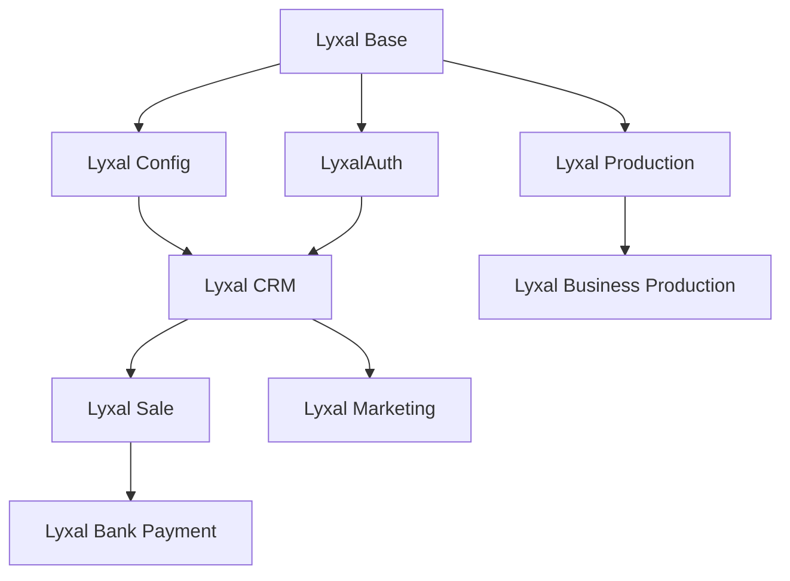

# 🗺️ Feuille de Route Consolidée - Modules LyxalSuite

## 📋 Vue d'ensemble

Cette feuille de route consolidée présente la planification de développement pour tous les modules de LyxalSuite, organisée par priorité et dépendances.

## 🎯 Modules par Priorité

### 🔥 **Priorité 1 - Modules Fondamentaux**

#### **Lyxal Base** ✅ *Consolidé*
- **Statut** : Documentation centralisée (27 fichiers)
- **Prochaines étapes** : Finalisation des spécifications IA-native

#### **Lyxal Config** ✅ *Consolidé*
- **Statut** : Documentation centralisée (5 fichiers)
- **Prochaines étapes** : Configuration SaaS multi-tenant

#### **LyxalAuth** ✅ *Consolidé*
- **Statut** : Architecture hexagonale complète
- **Prochaines étapes** : Intégration Logto avancée

### 🚀 **Priorité 2 - Modules Métier Core**

#### **Lyxal CRM**
- **Fichiers** : 3 documents (état des lieux, roadmap, surreal)
- **Objectifs** :
  - ✅ Migration SurrealDB
  - 🔄 Interface utilisateur moderne
  - ⏳ Intégration marketing automation

#### **Lyxal Sale**
- **Fichiers** : 3 documents (état des lieux, roadmap, surreal)
- **Objectifs** :
  - ✅ Architecture de base
  - 🔄 Processus de vente optimisés
  - ⏳ Intégration e-commerce

#### **Lyxal Bank Payment**
- **Fichiers** : 3 documents (spécs, plan amélioration, roadmap)
- **Objectifs** :
  - 🔄 Intégrations bancaires multiples
  - ⏳ Réconciliation automatique
  - ⏳ Conformité réglementaire

### 🏭 **Priorité 3 - Modules Production**

#### **Lyxal Production**
- **Objectifs** :
  - 🔄 Planification de production
  - ⏳ Suivi temps réel
  - ⏳ Optimisation des ressources

#### **Lyxal Business Production**
- **Objectifs** :
  - 🔄 Intégration ERP
  - ⏳ Analytics avancés
  - ⏳ Prédictions IA

### 🏢 **Priorité 4 - Modules Support**

#### **Lyxal Business Project**
- **Objectifs** :
  - 🔄 Gestion de projets
  - ⏳ Collaboration équipes
  - ⏳ Reporting avancé

#### **Lyxal Business Support**
- **Objectifs** :
  - 🔄 Support client intégré
  - ⏳ Knowledge base
  - ⏳ Automatisation

#### **Lyxal Helpdesk**
- **Objectifs** :
  - 🔄 Ticketing moderne
  - ⏳ SLA automatiques
  - ⏳ Intégration omnicanal

### 💰 **Priorité 5 - Modules Financiers**

#### **Lyxal Cash Management**
- **Objectifs** :
  - 🔄 Prévisions de trésorerie
  - ⏳ Optimisation placements
  - ⏳ Reporting réglementaire

#### **Lyxal Investor**
- **Objectifs** :
  - ⏳ Portail investisseurs
  - ⏳ Reporting financier
  - ⏳ Communication automatisée

### 🌐 **Priorité 6 - Modules Spécialisés**

#### **Lyxal Client Portal**
- **Objectifs** :
  - 🔄 Interface client moderne
  - ⏳ Self-service complet
  - ⏳ Personnalisation avancée

#### **Lyxal Marketing**
- **Objectifs** :
  - 🔄 Automation marketing
  - ⏳ Analytics comportementaux
  - ⏳ Personnalisation IA

#### **Lyxal GDPR**
- **Objectifs** :
  - 🔄 Conformité RGPD
  - ⏳ Gestion consentements
  - ⏳ Audit automatique

## 📅 Planning Global

### **Q1 2025** - Consolidation
- ✅ Centralisation documentation (Phase 2)
- 🔄 Finalisation modules Priority 1
- 🔄 Architecture hexagonale standardisée

### **Q2 2025** - Développement Core
- 🔄 Modules Priority 2 (CRM, Sale, Bank Payment)
- ⏳ Intégrations SurrealDB complètes
- ⏳ Tests end-to-end

### **Q3 2025** - Extension Production
- ⏳ Modules Priority 3 (Production)
- ⏳ Analytics et reporting avancés
- ⏳ Optimisations performance

### **Q4 2025** - Finalisation
- ⏳ Modules Priority 4-6
- ⏳ Intégrations complètes
- ⏳ Documentation utilisateur finale

## 🔗 Dépendances Inter-Modules

## 📊 Métriques de Succès

- **Documentation** : 100% centralisée ✅
- **Tests** : 90% couverture code
- **Performance** : <200ms temps réponse
- **Sécurité** : Audit sécurité complet
- **UX** : Score satisfaction >4.5/5

## 🚨 Risques Identifiés

1. **Complexité intégrations** - Mitigation : Architecture hexagonale
2. **Performance SurrealDB** - Mitigation : Optimisations requêtes
3. **Sécurité multi-tenant** - Mitigation : Audit continu
4. **Montée en charge** - Mitigation : Tests de charge

---

**Dernière mise à jour** : 19 Juin 2025  
**Version** : 2.0 - Phase 2 Consolidation  
**Responsable** : Équipe Architecture LyxalSuite