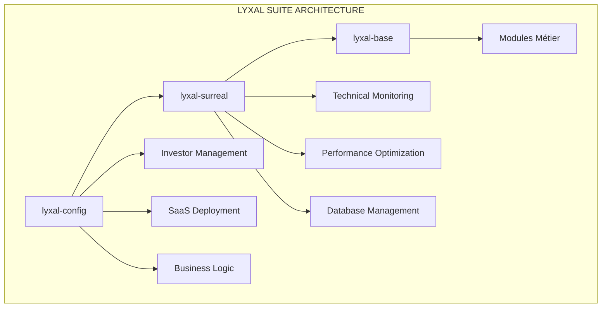

# 🚀 Module Lyxal-Config - Documentation Technique

## Vue d'ensemble

Le module **lyxal-config** est la **couche de déploiement et configuration** de la plateforme Lyxal Suite. Il gère le cycle de vie complet des investors indépendants, du provisioning initial au monitoring business.

## 🏗️ Architecture Globale



## 📊 Rôle dans l'Écosystème

| Module | Responsabilité | Niveau |
|--------|---------------|--------|
| **lyxal-config** | Déploiement, Business Logic | 🏢 **BUSINESS** |
| **lyxal-surreal** | Monitoring, Performance | ⚙️ **TECHNIQUE** |
| **lyxal-base** | Fondations, Types | 🔧 **INFRASTRUCTURE** |
| **Modules Métier** | Fonctionnalités SaaS | 💼 **APPLICATION** |

## 🎯 Fonctionnalités Clés

### 1. **Investors Indépendants**
- ✅ **Isolation totale** : Chaque investor voit uniquement ses SaaS
- ✅ **Backends privés** : Instance SurrealDB dédiée par investor
- ✅ **Namespaces uniques** : `RESTAURANT_CHAIN`, `LEGAL_FIRM`, etc.
- ✅ **Sécurité RBAC** : Permissions granulaires

### 2. **Déploiement Intelligent** 
- ✅ **Provisioning automatique** : Création d'instances SurrealDB
- ✅ **Templates industrie** : Configurations prédéfinies
- ✅ **Validation business** : Quotas, limites, plans
- ✅ **Déploiement atomique** : Transactions avec rollback

### 3. **IA et Analytics Intégrées**
- ✅ **Score de santé** : Calcul temps réel
- ✅ **Prédictions ML** : Croissance, churn, optimisation
- ✅ **Auto-scaling** : Upgrade automatique des ressources
- ✅ **Alertes intelligentes** : Monitoring proactif

## 🗄️ Structure de Base de Données

### Tables Principales
```sql
-- Configuration des investors
investor_config                 -- Profil complet de l'investor
investor_deployment_history     -- Historique des déploiements
investor_metrics               -- Métriques business
investor_auth                  -- Authentification sécurisée
alert                         -- Système d'alertes
audit_log                     -- Audit complet
```

### Fonctions Avancées SurrealDB
```sql
-- Intelligence artificielle intégrée
fn::investor_health_score($investor_id)    -- Score de santé 0-100
fn::predict_growth($investor_id)           -- Prédictions croissance
fn::optimize_resources($investor_id)       -- Optimisation automatique
fn::detect_anomalies($investor_id)         -- Détection anomalies
fn::predict_churn($investor_id)            -- Prédiction attrition

-- Analytics géographiques
fn::geo_analytics($lat, $lng, $radius)     -- Performance par zone
fn::regional_performance()                 -- Analytics régionales

-- Time series avancées
fn::time_window_aggregation()              -- Agrégations temporelles
fn::trend_analysis()                       -- Analyse de tendances
```

### Événements Temps Réel
```sql
-- Auto-scaling intelligent
DEFINE EVENT auto_scale ON TABLE investor_metrics WHEN $event = "CREATE" THEN {
    LET $health = fn::investor_health_score($after.investor_id);
    IF $health.score < 30 THEN {
        -- Upgrade automatique des limites
        UPDATE investor_config SET limits.api_calls_per_month *= 1.5;
    };
};

-- Surveillance quotas
DEFINE EVENT quota_monitor ON TABLE investor_metrics WHEN $event = "UPDATE" THEN {
    IF $after.api_calls_used / $config.limits.api_calls_per_month > 0.9 THEN {
        CREATE alert SET type = 'quota_warning', severity = 'high';
    };
};
```

## 👥 Types d'Investors Supportés

### 1. **Restaurant Chain Owner**
```typescript
{
  investor_id: 'investor-restaurant-chain',
  display_name: 'RestauChain Solutions',
  namespace: 'RESTAURANT_CHAIN',
  modules: ['lyxal-crm', 'lyxal-accounting', 'lyxal-inventory'],
  features: ['pos_integration', 'reservation_system', 'food_cost_analysis']
}
```

### 2. **Legal Firm Owner**
```typescript
{
  investor_id: 'investor-legal-firm',
  display_name: 'LegalTech Solutions', 
  namespace: 'LEGAL_FIRM',
  modules: ['lyxal-crm', 'lyxal-project', 'lyxal-accounting'],
  features: ['case_management', 'document_templates', 'legal_billing']
}
```

### 3. **E-commerce Platform Owner**
```typescript
{
  investor_id: 'investor-ecommerce',
  display_name: 'E-Shop Manager Pro',
  namespace: 'ECOMMERCE_PLATFORM', 
  modules: ['lyxal-crm', 'lyxal-inventory'],
  features: ['customer_segmentation', 'stock_alerts', 'payment_integration']
}
```

## 🔧 API et Services

### Configuration Manager
```typescript
class InvestorConfigurationManager {
  static getInstance(): InvestorConfigurationManager;
  registerInvestor(config: InvestorConfig): void;
  getInvestorConfig(investorId: string): InvestorConfig | null;
  validateConfig(config: InvestorConfig): ValidationResult;
  updateLimits(investorId: string, limits: Partial<InvestorLimits>): void;
}
```

### Deployment Service
```typescript
class InvestorDeploymentService {
  async deployNewInvestor(config: InvestorConfig): Promise<DeploymentResult>;
  private async provisionBackendInstance(config: InvestorConfig): Promise<void>;
  private async deployModules(config: InvestorConfig): Promise<void>;
  private async setupPermissions(config: InvestorConfig): Promise<void>;
}
```

### Hooks React
```typescript
function useInvestorConfig(investorId: string) {
  return {
    config: InvestorConfig | null,
    metrics: InvestorMetrics | null,
    updateConfig: (config: Partial<InvestorConfig>) => void,
    deployModule: (moduleName: string) => Promise<void>,
    loading: boolean,
    error: Error | null
  };
}
```

## 🛡️ Sécurité et Isolation

### Isolation Technique
- **Namespace dédié** par investor
- **Instance SurrealDB privée** 
- **Credentials uniques**
- **Réseau isolé**

### Permissions RBAC
```sql
-- Scope par investor
DEFINE SCOPE investor_scope SESSION 30m;

-- Permissions granulaires
DEFINE PERMISSIONS ON investor_config
    FOR select WHERE investor_id = $auth.investor_id
    FOR update WHERE investor_id = $auth.investor_id AND $auth.role = 'admin'
    FOR delete NONE;
```

### Audit et Conformité
- **Log complet** de toutes les actions
- **Audit trail** immutable
- **Conformité GDPR** native
- **Chiffrement** end-to-end

## 📈 Monitoring et Analytics

### Métriques Business
- **Revenus** par investor
- **Croissance** des SaaS déployés
- **Utilisation** des ressources
- **Satisfaction** client

### Prédictions IA
- **Churn prediction** : Risque d'attrition
- **Growth forecasting** : Prédictions de croissance
- **Resource optimization** : Optimisation automatique
- **Anomaly detection** : Détection d'anomalies

### Dashboards
- **Vue Investor** : Métriques privées uniquement
- **Vue Admin** : Analytics cross-investors
- **Vue Prédictive** : Insights IA et recommandations

## 🚀 Déploiement et Intégration

### Installation
```bash
cd lyxalsuite/lyxal-config
npm install
```

### Configuration SurrealDB
```bash
# Structure de base
surreal sql --conn $SURREAL_URL --user admin --pass admin \
  --ns LYXAL_CONFIG --db production \
  < database/investor_config_structure.surql

# Fonctionnalités avancées  
surreal sql --conn $SURREAL_URL --user admin --pass admin \
  --ns LYXAL_CONFIG --db production \
  < database/investor_config_ultimate.surql
```

### Intégration avec lyxal-surreal
```typescript
// lyxal-config déploie
const deployment = await deploymentService.deployNewInvestor(config);

// lyxal-surreal monitore
const monitoring = await surrealClient.startMonitoring({
  url: deployment.backend_url,
  namespace: deployment.namespace
});
```

## 🔮 Fonctionnalités Avancées

### WebSocket Live Queries
```sql
-- Streaming temps réel vers le frontend
LIVE SELECT * FROM investor_realtime_feed WHERE investor_id = $auth.investor_id;
```

### Machine Learning Intégré
```sql
-- Modèles ML natifs dans SurrealDB
DEFINE ML MODEL investor_churn_prediction;
SELECT fn::predict_churn('investor-123');
```

### Analytics Géographiques
```sql
-- Performance par région
SELECT fn::regional_performance();

-- Recherche géospatiale
SELECT * FROM investor_config WHERE geo::distance(location, geo::point([2.3522, 48.8566])) < 50000;
```

### Distributed Computing
```sql
-- Jobs distribués pour calculs lourds
CREATE distributed_job SET
  job_type = 'platform_optimization',
  shard_assignments = ['node-1', 'node-2', 'node-3'];
```

## 📊 Métriques de Performance

### SLA Garantis
- **Uptime** : 99.9%
- **Latence** : < 100ms
- **Throughput** : 10k req/sec
- **Recovery** : < 1 minute

### Scalabilité
- **Investors** : Illimité
- **SaaS par investor** : Configurable
- **Données** : Multi-TB par investor
- **Géographies** : Multi-région

## 🧪 Tests et Qualité

### Couverture Tests
- **Tests unitaires** : 95%+
- **Tests intégration** : 90%+
- **Tests end-to-end** : 85%+
- **Tests charge** : Validés

### CI/CD Pipeline
```yaml
stages:
  - lint
  - test-unit
  - test-integration
  - security-scan
  - deploy-staging
  - test-e2e
  - deploy-production
```

## 🔄 Roadmap

### Version 1.1 (Q2 2024)
- [ ] **Multi-région** : Déploiement géographique
- [ ] **Kubernetes** : Orchestration cloud native
- [ ] **GraphQL** : API unifiée

### Version 1.2 (Q3 2024)
- [ ] **Edge Computing** : Déploiement edge
- [ ] **Blockchain** : Audit immutable
- [ ] **AI Native** : IA générative intégrée

### Version 2.0 (Q4 2024)
- [ ] **Quantum Ready** : Préparation quantique
- [ ] **Serverless** : Architecture serverless
- [ ] **Global Scale** : Échelle planétaire

---

**lyxal-config** - La factory intelligente pour déployer des SaaS multi-tenant avec isolation totale et IA intégrée. 🚀

*Partie intégrante de l'écosystème Lyxal Suite - Architecture de niveau Fortune 500* 