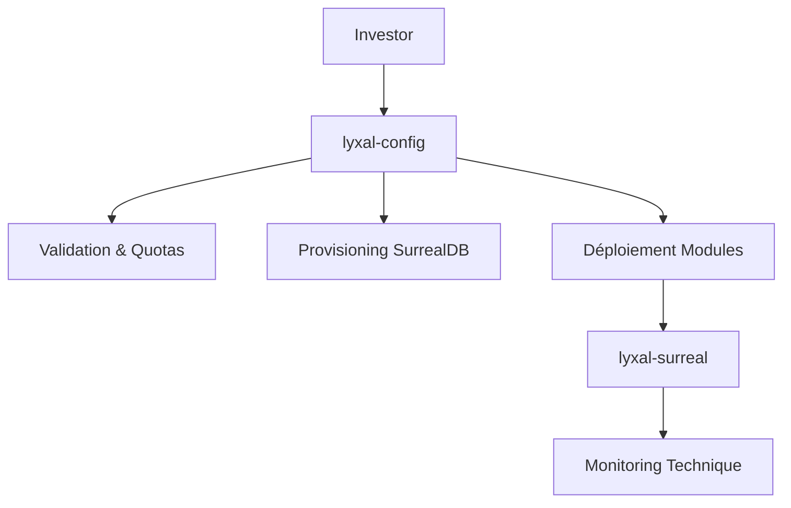

# 🚀 Lyxal Config - Module de Déploiement et Configuration

## Vue d'ensemble

Le module **Lyxal Config** est la **couche de déploiement** de la plateforme Lyxal Suite. Il gère la configuration, le provisioning et le déploiement des investors indépendants avec leurs backends SurrealDB privés.

## 🎯 Rôle dans l'Architecture



**lyxal-config** = Factory de déploiement
**lyxal-surreal** = Engine de monitoring

## 📁 Structure du Module

```
lyxal-config/
├── database/                    # Scripts SurrealDB
│   ├── investor_config_structure.surql   # Tables principales (95%)
│   └── investor_config_ultimate.surql    # Fonctionnalités avancées (100%)
├── investor/                    # Configuration des investors
│   ├── types/                   # Types TypeScript
│   ├── environments/            # Configs prédéfinies
│   ├── services/               # Services de déploiement
│   ├── hooks/                  # Hooks React
│   ├── components/             # Composants UI
│   └── ConfigurationManager.ts # Manager central
├── services/                   # Services généraux
└── index.ts                   # Point d'entrée
```

## 🏗️ Fonctionnalités Principales

### 1. **Gestion des Investors Indépendants**
- Chaque investor est **totalement isolé**
- Backend SurrealDB **privé** par investor
- Namespace **dédié** (ex: `RESTAURANT_CHAIN`, `LEGAL_FIRM`)
- Aucune visibilité croisée entre investors

### 2. **Déploiement Intelligent**
- **Provisioning automatique** des instances SurrealDB
- **Validation** des configurations et quotas
- **Templates par industrie** (Restaurant, Legal, E-commerce)
- **Déploiement atomique** avec rollback

### 3. **Gestion des Quotas et Plans**
- Plans : `trial`, `starter`, `professional`, `enterprise`
- Limites : SaaS déployables, clients par SaaS, stockage, API calls
- **Auto-scaling intelligent** basé sur l'usage
- **Alertes automatiques** de quotas

### 4. **Analytics et IA Intégrée**
- **Score de santé** calculé en temps réel
- **Prédictions de croissance** avec ML
- **Détection d'anomalies** statistiques
- **Optimisation automatique** des ressources

## 🚀 Installation et Usage

### Installation
```bash
cd lyxalsuite/lyxal-config
npm install
```

### Configuration de Base
```typescript
import { 
  InvestorConfigurationManager,
  InvestorDeploymentService,
  RESTAURANT_INVESTOR_CONFIG 
} from '@lyxal/config';

// Initialiser le manager
const configManager = InvestorConfigurationManager.getInstance();

// Déployer un nouvel investor
const deploymentService = new InvestorDeploymentService();
const result = await deploymentService.deployNewInvestor(RESTAURANT_INVESTOR_CONFIG);
```

### Déploiement SurrealDB
```bash
# 1. Déployer la structure de base
surreal sql --conn http://localhost:8000 --user admin --pass admin --ns LYXAL_CONFIG --db production < database/investor_config_structure.surql

# 2. Ajouter les fonctionnalités avancées
surreal sql --conn http://localhost:8000 --user admin --pass admin --ns LYXAL_CONFIG --db production < database/investor_config_ultimate.surql
```

## 🏢 Types d'Investors

### 1. **Restaurant Chain Owner**
```typescript
const restaurantInvestor = {
  investor_id: 'investor-restaurant-chain',
  display_name: 'RestauChain Solutions',
  namespace: 'RESTAURANT_CHAIN',
  modules: ['lyxal-crm', 'lyxal-accounting', 'lyxal-inventory'],
  industry_focus: 'restaurant'
};
```

### 2. **Legal Firm Owner**
```typescript
const legalInvestor = {
  investor_id: 'investor-legal-firm', 
  display_name: 'LegalTech Solutions',
  namespace: 'LEGAL_FIRM',
  modules: ['lyxal-crm', 'lyxal-project', 'lyxal-accounting'],
  industry_focus: 'legal'
};
```

### 3. **E-commerce Platform Owner**
```typescript
const ecommerceInvestor = {
  investor_id: 'investor-ecommerce',
  display_name: 'E-Shop Manager Pro', 
  namespace: 'ECOMMERCE_PLATFORM',
  modules: ['lyxal-crm', 'lyxal-inventory'],
  industry_focus: 'ecommerce'
};
```

## 🛡️ Sécurité et Isolation

### Isolation Totale
- **Namespace privé** par investor
- **Backend dédié** (URL + credentials)
- **Permissions RBAC** granulaires
- **Audit automatique** de toutes les actions

### Authentification
```sql
-- Scope dédié par investor
DEFINE SCOPE investor_scope SESSION 30m
    SIGNUP ( CREATE user SET email = $email, investor_id = $investor_id )
    SIGNIN ( SELECT * FROM user WHERE email = $email AND investor_id = $investor_id );
```

### Permissions
```sql
-- Les investors ne voient QUE leurs données
DEFINE PERMISSIONS ON investor_config
    FOR select WHERE investor_id = $auth.investor_id
    FOR update WHERE investor_id = $auth.investor_id;
```

## 📊 Fonctionnalités Avancées SurrealDB

### 1. **Fonctions Intelligentes**
```sql
-- Score de santé en temps réel
SELECT fn::investor_health_score('investor-123');

-- Prédictions de croissance
SELECT fn::predict_growth('investor-123');

-- Optimisation des ressources
SELECT fn::optimize_resources('investor-123');
```

### 2. **Événements Temps Réel**
```sql
-- Auto-scaling automatique
DEFINE EVENT auto_scale ON TABLE investor_metrics WHEN $event = "CREATE" THEN {
    LET $health = fn::investor_health_score($after.investor_id);
    IF $health.score < 30 THEN {
        -- Upgrade automatique des limites
        UPDATE investor_config SET limits.api_calls_per_month *= 1.5;
    };
};
```

### 3. **WebSocket Live Queries**
```sql
-- Streaming temps réel vers le frontend
LIVE SELECT * FROM investor_realtime_feed WHERE investor_id = $auth.investor_id;
```

### 4. **Machine Learning Intégré**
```sql
-- Prédiction de churn
SELECT fn::predict_churn('investor-123');

-- Détection d'anomalies
SELECT fn::detect_anomalies('investor-123');
```

### 5. **Analytics Géographiques**
```sql
-- Performance par région
SELECT fn::regional_performance();

-- Investors dans un rayon
SELECT fn::geo_analytics(48.8566, 2.3522, 50); -- Paris, 50km
```

## 🔧 API du Configuration Manager

### Méthodes Principales
```typescript
class InvestorConfigurationManager {
  // Enregistrer un investor
  registerInvestor(config: InvestorConfig): void;
  
  // Obtenir la configuration
  getInvestorConfig(investorId: string): InvestorConfig | null;
  
  // Valider une configuration
  validateConfig(config: InvestorConfig): ValidationResult;
  
  // Mettre à jour les limites
  updateLimits(investorId: string, limits: Partial<InvestorLimits>): void;
  
  // Obtenir les métriques
  getMetrics(investorId: string): InvestorMetrics;
}
```

### Service de Déploiement
```typescript
class InvestorDeploymentService {
  // Déployer un nouvel investor
  async deployNewInvestor(config: InvestorConfig): Promise<DeploymentResult>;
  
  // Provisionner le backend
  private async provisionBackendInstance(config: InvestorConfig): Promise<void>;
  
  // Déployer les modules
  private async deployModules(config: InvestorConfig): Promise<void>;
}
```

## 🎯 Hooks React

### useInvestorConfig
```typescript
import { useInvestorConfig } from '@lyxal/config';

function InvestorDashboard() {
  const { 
    config, 
    metrics, 
    updateConfig, 
    deployModule,
    loading,
    error 
  } = useInvestorConfig('investor-123');
  
  return (
    <div>
      <h1>{config?.display_name}</h1>
      <p>Health Score: {metrics?.health_score}</p>
      <button onClick={() => deployModule('lyxal-crm')}>
        Deploy CRM
      </button>
    </div>
  );
}
```

## 📈 Monitoring et Analytics

### Métriques Collectées
- **Usage API** : Appels par mois, tendances
- **Stockage** : GB utilisés, croissance
- **Déploiements** : SaaS actifs, succès/échecs
- **Performance** : Temps de réponse, erreurs
- **Business** : Revenus, croissance, churn

### Dashboards
- **Vue Investor** : Ses SaaS uniquement
- **Vue Globale** : Analytics cross-investors (admin)
- **Prédictions** : ML pour optimisation

## 🚨 Alertes et Notifications

### Types d'Alertes
- **Quota Warning** : API/Stockage > 90%
- **Performance Issue** : Temps réponse élevé
- **Security Alert** : Tentatives d'accès suspects
- **Billing Issue** : Problèmes de facturation

### Auto-Actions
- **Auto-scaling** : Upgrade automatique si critique
- **Load Balancing** : Redistribution de charge
- **Backup** : Sauvegardes automatiques

## 🔄 Intégration avec lyxal-surreal

```typescript
// lyxal-config déploie
const deployment = await deploymentService.deployNewInvestor(config);

// lyxal-surreal monitore
const monitoring = await surrealClient.startMonitoring(deployment.backend_url);
```

## 🧪 Tests

```bash
# Tests unitaires
npm test

# Tests d'intégration
npm run test:integration

# Tests de déploiement
npm run test:deployment
```

## 📝 Logs et Debugging

```typescript
import { Logger } from '@lyxal/config';

const logger = new Logger('InvestorDeployment');
logger.info('Deploying investor', { investorId: 'test-123' });
logger.error('Deployment failed', error);
```

## 🔮 Roadmap

### Version 1.1
- [ ] **Multi-région** : Déploiement géographique
- [ ] **Kubernetes** : Orchestration cloud
- [ ] **GraphQL** : API unifiée

### Version 1.2  
- [ ] **Blockchain** : Audit immutable
- [ ] **Edge Computing** : Déploiement edge
- [ ] **AI Native** : IA générative intégrée

## 🤝 Contribution

1. Fork le repository
2. Créer une branche feature
3. Commit les changements
4. Push vers la branche
5. Créer une Pull Request

## 📄 License

MIT License - voir le fichier LICENSE pour plus de détails.

---

**Lyxal Config** - La factory intelligente pour déployer des SaaS multi-tenant avec isolation totale et IA intégrée. 🚀 