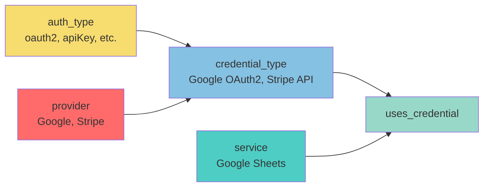

# 🔐 Credentials - Structure de Base de Données

Ce dossier contient toutes les tables liées au système d'authentification et de gestion des credentials pour le module d'intégration.

---

## 📂 Structure des Fichiers

```
credentials/
├── README.md                    # Ce fichier
├── auth_type.surql              # Types d'authentification (OAuth2, API Key, etc.)
├── credential_type.surql        # Types de credentials spécifiques aux providers
└── uses_credential.surql        # Relation service <-> credential_type
```

---

## 🏗️ Architecture

### Hiérarchie des Tables

```
auth_type (Référentiel des types d'auth)
    ↓ utilisé par
credential_type (Configuration spécifique par provider)
    ↓ lié par
uses_credential (Relation)
    ↓ à
service (Service qui utilise le credential)
```

### Schéma Relationnel



---

## 📊 Tables Détaillées

### 1. `auth_type` - Types d'Authentification

**Objectif** : Référentiel des différents types d'authentification supportés.

**Types disponibles** :
- `oauth2` - OAuth 2.0 (le plus populaire)
- `oauth1` - OAuth 1.0a (legacy)
- `apiKey` - Clé API simple
- `basicAuth` - Basic Authentication
- `bearerToken` - Token Bearer
- `digestAuth` - Digest Authentication
- `headerAuth` - Header personnalisé
- `queryAuth` - Query parameters
- `custom` - Authentification personnalisée

**Champs clés** :
```surql
{
    name: "oauth2",
    display_name: "OAuth 2.0",
    description: "...",
    security_level: 5,        // 1-5
    popularity_score: 95,     // 0-100
    config_schema: {...},     // Schéma de config attendu
    supports_refresh: true,
    requires_user_interaction: true
}
```

**Avantages d'une table dédiée** :
- ✅ Ajout de nouveaux types sans modifier le schéma
- ✅ Métadonnées riches (description, sécurité, popularité)
- ✅ Configuration validée par type
- ✅ Activation/désactivation sans suppression
- ✅ Documentation intégrée

**Exemple de requête** :
```surql
-- Types recommandés (popularité > 70)
SELECT * FROM auth_type 
WHERE popularity_score >= 70 
  AND is_active = true
ORDER BY popularity_score DESC;
```

---

### 2. `credential_type` - Types de Credentials

**Objectif** : Configuration spécifique des credentials pour chaque provider/service.

**Champs clés** :
```surql
{
    name: "googleSheetsOAuth2Api",
    display_name: "Google Sheets OAuth2 API",
    slug: "google-sheets-oauth2",
    auth_type_id: auth_type:oauth2,        // Référence vers auth_type
    provider_id: provider:google,           // Référence vers provider
    oauth2_config: {                        // Config OAuth2 spécifique
        auth_url: "...",
        token_url: "...",
        scope: "..."
    },
    required_fields: [                      // Champs requis
        {name: "client_id", ...},
        {name: "client_secret", ...}
    ]
}
```

**Relations** :
- `auth_type_id` → `auth_type` (type d'authentification)
- `provider_id` → `provider` (fournisseur, optionnel)

**Configuration par type d'auth** :

| auth_type | Configuration | Champs requis |
|-----------|---------------|---------------|
| `oauth2` | `oauth2_config` | client_id, client_secret |
| `oauth1` | `oauth1_config` | consumer_key, consumer_secret |
| `apiKey` | - | api_key |
| `basicAuth` | - | username, password |
| `bearerToken` | - | token |

**Exemple de requête** :
```surql
-- Credentials OAuth2 avec détails du type
SELECT 
    credential_type.*,
    auth_type.display_name AS auth_type_name,
    auth_type.security_level
FROM credential_type
INNER JOIN auth_type ON credential_type.auth_type_id = auth_type.id
WHERE auth_type_id = auth_type:oauth2;
```

---

### 3. `uses_credential` - Relation Service ↔ Credential

**Objectif** : Lie un service à un ou plusieurs types de credentials qu'il peut utiliser.

**Champs clés** :
```surql
{
    in: service:google_sheets,              // Service
    out: credential_type:google_oauth2,     // Credential type
    is_required: true,                      // Obligatoire ?
    is_recommended: true,                   // Recommandé ?
    display_order: 1,                       // Ordre d'affichage
    display_conditions: {...}               // Conditions d'affichage
}
```

**Cas d'usage** :

**Service avec un seul credential** :
```surql
service:stripe -> uses_credential -> credential_type:stripe_api
```

**Service avec plusieurs options** :
```surql
service:google_sheets -> uses_credential -> credential_type:google_oauth2 (recommandé)
                      -> uses_credential -> credential_type:google_service_account (alternatif)
```

**Exemple de requête** :
```surql
-- Tous les credentials d'un service
SELECT 
    credential_type.*,
    uses_credential.is_required,
    uses_credential.is_recommended,
    auth_type.display_name AS auth_type_name
FROM uses_credential
INNER JOIN credential_type ON uses_credential.out = credential_type.id
INNER JOIN auth_type ON credential_type.auth_type_id = auth_type.id
WHERE uses_credential.in = service:google_sheets
ORDER BY uses_credential.display_order;
```

---

## 🎯 Cas d'Usage

### Use Case 1 : Ajouter un nouveau type d'authentification

**Scénario** : Vous devez supporter un nouveau type d'auth (ex: SAML)

```surql
-- 1. Créer le type d'auth
CREATE auth_type:saml SET
    name = "saml",
    display_name = "SAML 2.0",
    slug = "saml",
    description = "Security Assertion Markup Language for SSO",
    security_level = 5,
    popularity_score = 60,
    is_active = true;

-- 2. Créer un credential type qui l'utilise
CREATE credential_type SET
    name = "oktaSaml",
    display_name = "Okta SAML",
    slug = "okta-saml",
    auth_type_id = auth_type:saml,
    provider_id = provider:okta,
    required_fields = [
        {name: "entity_id", display_name: "Entity ID", type: "string"},
        {name: "certificate", display_name: "X.509 Certificate", type: "text"}
    ];
```

---

### Use Case 2 : Configurer un service avec plusieurs credentials

**Scénario** : Google Sheets supporte OAuth2 et Service Account

```surql
-- OAuth2 (recommandé pour utilisateurs)
RELATE service:google_sheets->uses_credential->credential_type:google_oauth2 SET
    is_required = true,
    is_recommended = true,
    display_order = 1,
    custom_description = "Recommended for most users";

-- Service Account (pour automation serveur)
RELATE service:google_sheets->uses_credential->credential_type:google_service_account SET
    is_required = false,
    is_recommended = false,
    display_order = 2,
    custom_label = "Service Account (Advanced)",
    custom_description = "For server-to-server automation";
```

---

### Use Case 3 : Récupérer la configuration complète pour un formulaire

**Scénario** : Afficher un formulaire de configuration de credentials

```surql
SELECT {
    credential_type: credential_type.*,
    auth_type: (SELECT * FROM auth_type WHERE id = credential_type.auth_type_id)[0],
    provider: (SELECT * FROM provider WHERE id = credential_type.provider_id)[0],
    required_fields: credential_type.required_fields,
    config_schema: auth_type.config_schema,
    security_info: {
        level: auth_type.security_level,
        complexity: auth_type.implementation_complexity,
        advantages: auth_type.advantages,
        disadvantages: auth_type.disadvantages
    }
} FROM credential_type
INNER JOIN auth_type ON credential_type.auth_type_id = auth_type.id
WHERE credential_type.slug = "google-sheets-oauth2";
```

---

## 📈 Statistiques et Analyse

### Popularité des types d'auth

```surql
SELECT 
    auth_type.display_name,
    auth_type.popularity_score,
    count() AS credential_count
FROM credential_type
INNER JOIN auth_type ON credential_type.auth_type_id = auth_type.id
GROUP BY auth_type.id, auth_type.display_name, auth_type.popularity_score
ORDER BY credential_count DESC;
```

### Services par niveau de sécurité

```surql
SELECT 
    auth_type.security_level,
    auth_type.display_name AS auth_type,
    count() AS service_count
FROM uses_credential
INNER JOIN credential_type ON uses_credential.out = credential_type.id
INNER JOIN auth_type ON credential_type.auth_type_id = auth_type.id
GROUP BY auth_type.security_level, auth_type.display_name
ORDER BY auth_type.security_level DESC;
```

### Credentials les plus utilisés

```surql
SELECT 
    credential_type.display_name,
    count() AS service_count
FROM uses_credential
INNER JOIN credential_type ON uses_credential.out = credential_type.id
GROUP BY credential_type.id, credential_type.display_name
ORDER BY service_count DESC
LIMIT 10;
```

---

## 🔍 Validation et Maintenance

### Vérifier l'intégrité

```surql
-- Credentials avec auth_type invalide
SELECT * FROM credential_type 
WHERE auth_type_id NOT IN (SELECT id FROM auth_type);

-- Relations orphelines
SELECT * FROM uses_credential 
WHERE in NOT IN (SELECT id FROM service)
   OR out NOT IN (SELECT id FROM credential_type);

-- Services sans credentials
SELECT * FROM service 
WHERE id NOT IN (
    SELECT DISTINCT in FROM uses_credential
);
```

### Nettoyer les données

```surql
-- Désactiver un type d'auth obsolète
UPDATE auth_type:oauth1 SET is_active = false;

-- Supprimer une relation inutilisée
DELETE uses_credential 
WHERE in = service:old_service 
  AND out = credential_type:deprecated_credential;
```

---

## 🎨 Patterns de Configuration

### Pattern 1 : Credential Unique

Un service utilise un seul type de credential.

**Exemple** : Stripe → API Key

```surql
service:stripe -> uses_credential -> credential_type:stripe_api
```

### Pattern 2 : Credentials Multiples avec Recommandation

Un service supporte plusieurs credentials avec un recommandé.

**Exemple** : Google Sheets → OAuth2 (recommandé) + Service Account

```surql
service:google_sheets -> uses_credential (recommended) -> credential_type:google_oauth2
                      -> uses_credential (advanced) -> credential_type:google_service_account
```

### Pattern 3 : Credentials Conditionnels

Différents credentials selon le contexte (plan, version, etc.)

```surql
RELATE service:premium_api->uses_credential->credential_type:oauth2 SET
    display_conditions = {
        show: {
            plan: ["premium", "enterprise"]
        }
    };
```

---

## 🚀 Ordre d'Import

Pour importer correctement les tables, respectez cet ordre :

```bash
# 1. Auth types (indépendant)
surreal import auth_type.surql

# 2. Credential types (dépend de auth_type et provider)
surreal import credential_type.surql

# 3. Relations (dépend de service et credential_type)
surreal import uses_credential.surql
```

---

## 📚 Ressources Complémentaires

- **Schéma complet** : `../schema/integration_schema.surql`
- **Documentation** : `../schema/INTEGRATION_ARCHITECTURE.md`
- **Exemples** : Voir les sections commentées dans chaque fichier

---

## ✅ Avantages de cette Architecture

### 1. Flexibilité
- Ajout de nouveaux types d'auth sans migration
- Configuration spécifique par provider
- Multiple credentials par service

### 2. Richesse des Métadonnées
- Niveau de sécurité
- Complexité d'implémentation
- Popularité
- Avantages/Inconvénients documentés

### 3. Validation
- Schémas de configuration par type
- Champs requis définis
- Templates pré-remplis

### 4. Évolutivité
- Désactivation sans suppression
- Versioning possible
- Conditions d'affichage

### 5. Documentation Intégrée
- Description détaillée
- Exemples de providers
- Cas d'usage
- URLs de documentation

---

**Dernière mise à jour** : 2025-10-28  
**Version** : 1.0.0

