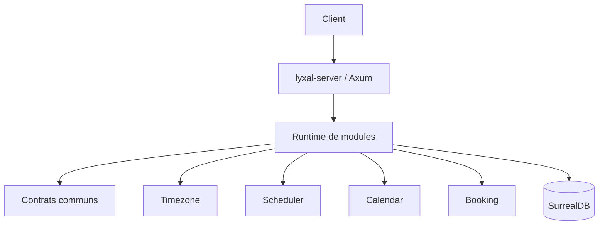
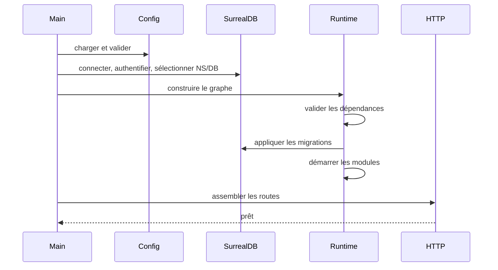

# Architecture de lyxal-server

## Position

## Principe

Le serveur orchestre. Les modules possèdent leur logique, leurs routes, leurs
migrations et leurs workers.

## Démarrage

## Arrêt

Les modules sont arrêtés dans l'ordre inverse de leur démarrage. Chaque arrêt
possède un délai maximal. Un échec est journalisé et reflété dans le registre
de santé.
