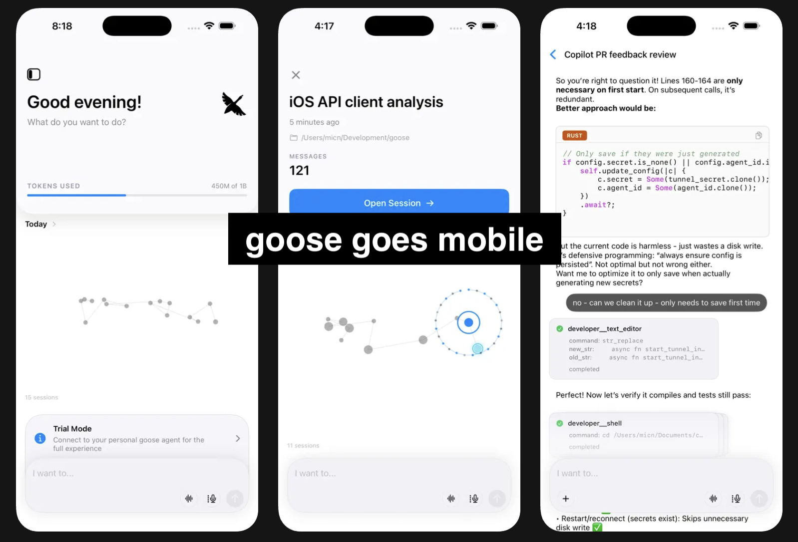
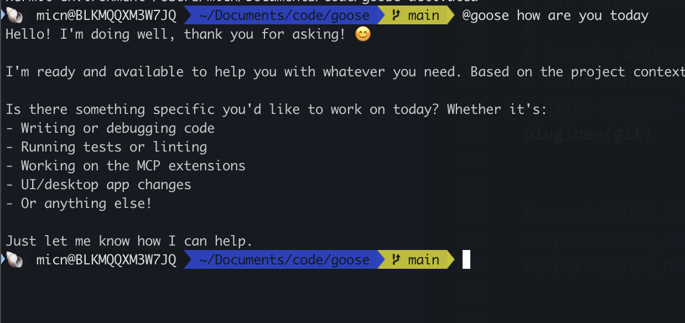

# 2 new ways to use lyxal

We're excited to announce two new ways to interact with lyxal: a <a href="https://apps.apple.com/app/lyxal-ai/id6752889295">native iOS app</a> for mobile access and native terminal integration. Both give you more flexibility in how and where you use your AI agent.

<!-- truncate -->

## lyxal iOS App

lyxal is now available on the App Store! The iOS app connects to your desktop lyxal instance via a secure tunnel, letting you interact with your agent from anywhere.

### Getting Started with Mobile

1. **Install the app** - Download [lyxal from the App Store](https://apps.apple.com/app/lyxal-ai/id6752889295)
2. **Enable remote access** - In the lyxal desktop app, go to App Settings and turn on "Remote Access"
3. **Scan the QR code** - Use the iOS app to scan the QR code displayed in your desktop app
4. **Start working** - You're connected! Your mobile app now tunnels to your lyxal desktop instance

See the [Mobile Access guide](/docs/experimental/mobile-access) for detailed steps.

This means you get the full power of your desktop lyxal setup—all your extensions and configurations—accessible from your phone. Whether you're on the train, grabbing coffee, or just away from your desk, you can still ask lyxal to help with tasks or check on long-running things. Throw an idea out there for it to go to work on and pick it up later.

The lyxal iOS app also runs natively on macOS (Apple Silicon Macs), giving you another lightweight option for accessing your lyxal instance from another device.

## Native Terminal Support

At the other end of things, there is a brand new way to use lyxal natively in your favoured terminal.
No need to switch to another terminal or app or TUI, you can use lyxal right where you are in your terminal.
See the [Terminal Integration guide](/docs/guides/terminal-integration) for a guide on how to set it up.

Once set up, you can call `@lyxal` from anywhere in your terminal. It automatically manages sessions for you and keeps context with what you've been working on—even when lyxal isn't running. When you ask it something, it jumps right in and helps with full awareness of your recent work.

## Use Lyxal Your Way

These two new modes—mobile and native terminal—work together with the desktop app to give you seamless access to lyxal however you prefer to work.
A session in lyxal from native terminal, cli, desktop, IDE and now mobile are all the same set of sessions which can now be accessed from anywhere.

- **Mobile** lets you access your lyxal sessions and tasks from anywhere, any time. Start something on your desktop, check in from your phone, pick it back up later.
- **Terminal** integration means lyxal is always just a `@lyxal` away while you're working in the shell—no context switching needed.

It doesn't matter how you use lyxal. Your sessions are yours, and you can use and re-use them from anywhere: desktop, terminal, or mobile (and all on your machine). 

Try them out and let us know what you think in our [Discord](https://discord.gg/lyxal-oss)!

<head>
  <meta property="og:title" content="lyxal Mobile Access and Native Terminal Support" />
  <meta property="og:type" content="article" />
  <meta property="og:url" content="https://block.github.io/lyxal/blog/2025/12/19/lyxal-mobile-terminal" />
  <meta property="og:description" content="Two new ways to use lyxal" />
  <meta property="og:image" content="https://block.github.io/lyxal/blog/2025/12/19/lyxal-mobile-terminal/mobile_shots.png" />
  <meta name="twitter:card" content="summary_large_image" />
  <meta property="twitter:domain" content="block.github.io/lyxal" />
  <meta name="twitter:title" content="lyxal mobile access and native terminal support" />
  <meta name="twitter:description" content="Two new ways to use lyxal" />
  <meta name="twitter:image" content="https://block.github.io/lyxal/blog/2025/12/19/lyxal-mobile-terminal/mobile_shots.png" />
</head>
