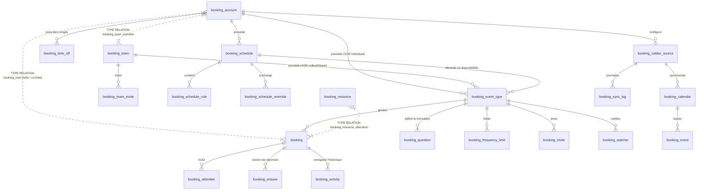

# Documentation du Schéma SurrealDB Officiel V1 (`lyxal_booking`)

Ce document présente la structure globale, les **25 tables cœur officielles** (plus les 2 tables héritées dans `schema/legacy/`), les relations Graph, les permissions `$auth` et les assertions strictes pour la solution **Lyxal Booking**.

---

## 📌 Vue d'ensemble des 25 Tables Cœur & Relations Graph

Le modèle de données officiel de `lyxal_booking` est structuré en **25 tables et relations graph natives (`SCHEMAFULL` / `TYPE RELATION`)** réparties dans 7 grands domaines applicatifs :

| Domaines | Tables SurrealDB | Type | Description Synthétique |
| :--- | :--- | :--- | :--- |
| **Comptes & Équipes** | `booking_account` | `TYPE NORMAL` | Profils hôtes, fuseaux horaires, langues et préférences UI. |
| | `booking_team` | `TYPE NORMAL` | Équipes et organisations pour réservations collectives / Round-Robin. |
| | `booking_team_member` | `TYPE RELATION` | **Graph** `booking_account -> booking_team` avec rôles (`owner`, `admin`, `member`) et poids Round-Robin (0-100). |
| | `booking_team_invite` | `TYPE NORMAL` | Invitations envoyées par e-mail pour rejoindre une équipe avec jeton unique. |
| **Plannings & Absences** | `booking_schedule` | `TYPE NORMAL` | Plannings réutilisables d'horaires de travail ("Horaires de bureau", "Astreinte"). |
| | `booking_schedule_rule` | `TYPE NORMAL` | Plages hebdomadaires récurrentes du planning (Assertion Regex `HH:MM`). |
| | `booking_schedule_override` | `TYPE NORMAL` | Exceptions et surcharges de dates par planning (Assertion Regex `YYYY-MM-DD`). |
| | `booking_time_off` | `TYPE NORMAL` | Congés, absences et vacances bloquant tous les plannings et agendas d'un hôte. |
| **Types d'Événements** | `booking_event_type` | `TYPE NORMAL` | Liens publics de RDV (**Propriété exclusive `account` XOR `team`**, rattaché à un `schedule`). |
| | `booking_frequency_limit` | `TYPE NORMAL` | Quotas de réservations autorisées par période (`day`, `week`, `month`). |
| | `booking_invite` | `TYPE NORMAL` | Invitations éphémères et liens à usage unique pour réserver. |
| | `booking_watcher` | `TYPE NORMAL` | E-mails notifiés automatiquement en copie lors des réservations. |
| **Formulaires Dynamiques** | `booking_question` | `TYPE NORMAL` | Questions sur-mesure configurables par type d'événement (`text`, `select`, `checkbox`...). |
| | `booking_answer` | `TYPE NORMAL` | Réponses fournies par le client / invité lors de la réservation. |
| **Réservations & Hôtes** | `booking` | `TYPE NORMAL` | Prises de rendez-vous avec hôte principal (`host`), méthode d'attribution (`fixed`, `round_robin`, `manual`, `collective`). |
| | `booking_host` | `TYPE RELATION` | **Graph** `booking_account -> booking` pour attribution des hôtes principaux et co-hôtes (événements multi-hôtes). |
| | `booking_attendee` | `TYPE NORMAL` | Participants additionnels rattachés à la réservation. |
| | `booking_activity` | `TYPE NORMAL` | **Journal d'historique Append-Only immuable** (`created`, `rescheduled`, `cancelled`, `host_changed`...). |
| **Calendriers Distants** | `booking_caldav_source` | `TYPE NORMAL` | Sources externes (CalDAV, Google, EWS, iCloud) avec jetons & clés OAuth. |
| | `booking_calendar` | `TYPE NORMAL` | Calendriers distants synchronisés (`is_busy`, `color`, `ctag`). |
| | `booking_event` | `TYPE NORMAL` | Événements distants bloquant la disponibilité de l'hôte. |
| | `booking_sync_log` | `TYPE NORMAL` | Journal de diagnostic des synchronisations distantes et suivi d'erreurs. |
| **Ressources & Config** | `booking_resource` | `TYPE NORMAL` | Salles de réunion et matériels physiques réservables avec capacité. |
| | `booking_resource_allocation` | `TYPE RELATION` | **Graph** `booking_resource -> booking` avec plage temporelle d'occupation. |
| | `booking_setting` | `TYPE NORMAL` | Paramètres système globaux et configuration SMTP réservés aux admins `$auth`. |

---

## 📁 Tables Héritées (Isolées dans `schema/legacy/`)

Les anciennes tables de disponibilité directe rattachées aux types d'événements sont isolées pour les besoins de migration :
- `schema/legacy/booking_availability_rule.surql`
- `schema/legacy/booking_availability_override.surql`

---

## 📊 Diagramme des Relations & Graphes (ERD Officiel V1)

---

## 🔒 Décisions Structurantes Validées (Figeage du Schéma V1)

1. **Isolation des Tables Héritées (`schema/legacy/`)** : Le schéma officiel comporte **25 tables propres**. Les 2 tables d'anciennes règles sont isolées sous `schema/legacy/`.
2. **Propriété Exclusive XOR (`account XOR team`)** : Assertion stricte sur `booking_event_type` garantissant qu'un type d'événement est soit individuel (`account`), soit d'équipe (`team`), mais jamais les deux ni aucun des deux.
3. **Multi-Hôtes et Co-Hôtes (`booking_host`)** : Les réunions collectives (`assignment_method = 'collective'`) ou partagées prennent en charge plusieurs hôtes via la relation Graph `booking_host` (`is_primary: bool`).
