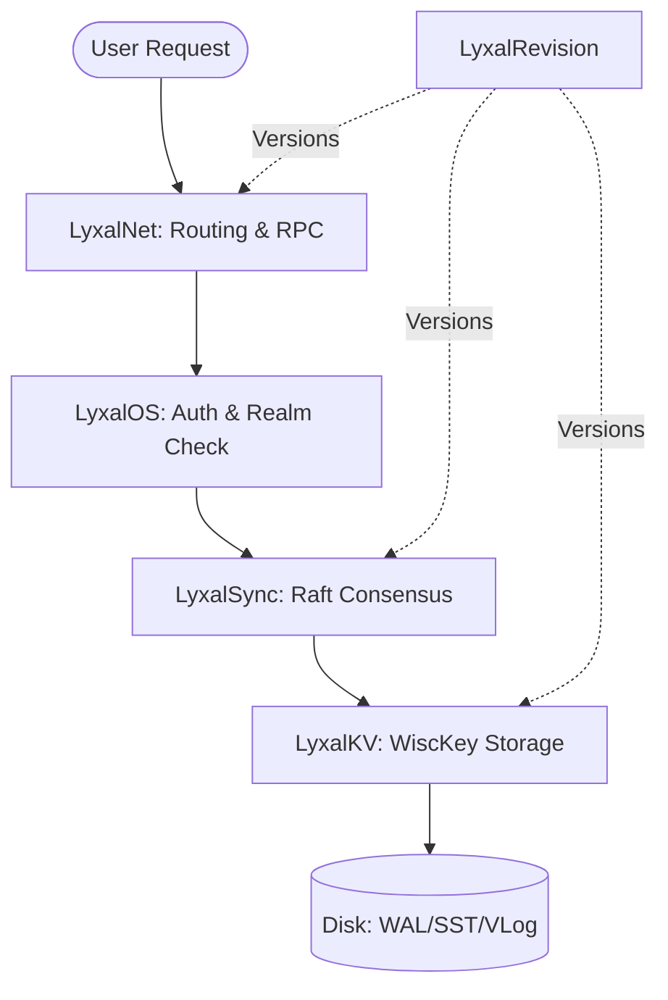

# Lyxal Solution: Component Architecture

This document provides a detailed breakdown of the specialized crates that constitute the Lyxal ecosystem.

## 1. Core Storage: LyxalKV (`lyxalkv`)
The high-performance storage backbone of Lyxal. It implements a **WiscKey** architecture to optimize performance in cloud and flash-storage environments.

- **LSM-Tree**: Manages keys and value pointers, keeping the index small and shallow for fast compactions.
- **Value Log (VLog)**: Stores actual data separately to reduce Write Amplification (WA).
- **WAL (Write-Ahead Log)**: Ensures data durability and recovery across crashes.
- **Atomic Checkpoints**: Provides point-in-time, consistent backups without blocking writes.
- **MVCC & Oracle**: Implements snapshot isolation and prevents inconsistent reads during concurrent transactions.

## 2. Distributed Control Plane: LyxalOS (`lyxal_os`)
The "Kernel" of the system, responsible for multi-tenancy and high-level governance.

- **Realms**: Logical partitions for multi-tenant isolation, each with its own quotas and configuration.
- **Consensus Manager**: Orchestrates distributed leadership using the Raft protocol.
- **Raft Persistence**: Saves consensus state (terms, logs, votes) to LyxalKV to ensure stability across node restarts.
- **Resource Accounting**: Monitors and throttles usage per Realm.
- **Kernel Orchestrator**: Manages the lifecycle of services and system-wide boot/shutdown sequences.

## 3. Intelligent Networking: LyxalNet (`lyxal_net`)
A specialized P2P networking layer designed for distributed database workloads.

- **Leader-Aware Routing**: Automatically routes queries to the current Raft Leader or consistent Followers.
- **Direct RPC Messaging**: Replaces noisy broadcasts with targeted peer-to-peer communication for consensus messages.
- **Node Identity**: Cryptographically verified identities using public-key infrastructure.
- **Connection Management**: Handles handshakes, session encryption, and heartbeat monitoring.

## 4. Consistency Protocol: LyxalSync (`lyxal_sync`)
The implementation of the consensus state machine and data synchronization protocols.

- **Raft Machine**: Core logic for leader election, log replication, and safety.
- **Vector Clocks**: Tracks causality and ordering of events across the cluster.
- **Anti-Entropy**: Background synchronization to resolve data drift between nodes.
- **Snapshots**: Generates and transfers compact representations of node state.

## 5. Evolutionary Serialization: LyxalRevision (`lyxal_revision`)
A high-performance framework ensuring data compatibility over time.

- **Explicit Versioning**: Tags every data structure with a revision number.
- **Backward Compatibility**: Allows new code to read older data formats on disk or over the wire.
- **Zero-Overhead Parsing**: Optimized memory layouts for current-version data.
- **Bulk I/O**: Specialized `unsafe` paths for high-throughput serialization of primitive vectors.

## 6. Real-Time Communication: RTC/SFU Engine
Integrated communication services that extend the database's capabilities into multi-party media.

- **SFU (Selective Forwarding Unit)**: Routes media streams for low-latency conferencing.
- **Signaling**: Integrated WebRTC handshake support via the database RPC protocol.
- **Webinar Roles**: Native management of speakers, viewers, and participants within the data layer.

---

## Component Interaction Overview

---
*Last updated: January 2025*