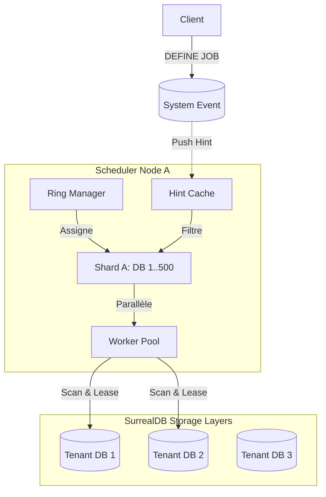

# Scheduler V2 : Architecture "Google-Grade" & Roadmap

**Statut** : Draft / RFC
**Cible** : SurrealDB Distributed Cluster (Multi-tenant)
**Objectif** : Passer d'un modèle "Polling Séquentiel" à une architecture "Distribuée, Event-Driven et Shardée".

---

## 1. Executive Summary

L'implémentation actuelle (V1) du scheduler repose sur un modèle de boucle séquentielle qui scanne les bases de données une par une. Bien que fonctionnel pour des déploiements modestes, ce modèle présente des goulots d'étranglement structurels pour un PaaS multi-tenant à grande échelle :
1.  **Latence linéaire** : Le temps de cycle augmente linéairement avec le nombre de bases de données (même vides).
2.  **Gaspillage CPU** : "Polling" constant de bases inactives.
3.  **Absence de partitionnement** : Chaque nœud tente de gérer l'ensemble du cluster.

L'architecture V2 vise une scalabilité horizontale infinie, une isolation stricte des tenants (Bulkheading) et une réactivité quasi temps-réel via une approche hybride Event-Driven.

---

## 2. État des Lieux V1 (Fichiers & Responsabilités)

Avant la migration, voici la cartographie des composants actuels et leurs rôles.

### Composants
1.  **Moteur Abstrait (`crates/scheduler/`)** :
    *   Contient la logique métier pure (`Job`, `CronParser`).
    *   *Problème* : Couplé à `InMemoryStore` par défaut, inadapté à la prod distribuée.
2.  **Service d'Intégration (`crates/server/src/scheduler/service.rs`)** :
    *   **Le Cerveau Actuel**. C'est ici que réside toute la logique de production.
    *   *Rôle* : Hydrate la liste des bases, boucle séquentiellement (Polling), exécute les requêtes SQL système vers `LyxalKV` via `Datastore`.
    *   *Problème* : Code monolithique qui mélange orchestration, persistance et logique métier.

### Flux de Données V1
`Scheduler Service` -> `Datastore (Core)` -> `LyxalKV (Storage)`

---

## 3. Piliers d'Architecture

### Pilier 1 : Abstraction du Stockage (The Core)
Le moteur de planification (`crates/scheduler`) doit être agnostique de la couche de persistance. Il ne doit manipuler que des abstractions.

**Changement** : Remplacement de `InMemoryStore` par un trait `TaskStore`.

```rust
#[async_trait]
pub trait TaskStore: Send + Sync {
    /// Récupère les jobs éligibles pour une partition donnée (ou globale)
    async fn fetch_due_jobs(&self, shard_info: ShardInfo) -> Result<Vec<Job>, SchedulerError>;
    
    /// Tente d'acquérir un lease distribué (Atomique)
    async fn acquire_lease(&self, job_id: &str, ttl: Duration) -> Result<bool, SchedulerError>;
    
    /// Met à jour l'état d'un job (ex: succès, échec, reprogrammation)
    async fn update_job_state(&self, job: Job) -> Result<(), SchedulerError>;
}
```

### Pilier 2 : Parallélisme & Async I/O
Remplacement de la boucle `for` séquentielle par un traitement concurrent borné.

**Problème V1** :
```rust
for db in databases {
    scan(db).await; // Bloque le thread, attend l'IO réseau
}
```

**Solution V2** : Utilisation de `FuturesUnordered` ou `tokio::spawn` avec un sémaphore global pour contrôler la pression sur le réseau sans bloquer le tick.

```rust
let semaphore = Arc::new(Semaphore::new(100)); // Max 100 scans simultanés
let mut tasks = FuturesUnordered::new();

for db in databases {
    let permit = semaphore.clone().acquire_owned().await;
    tasks.push(tokio::spawn(async move {
        let _permit = permit;
        scan(db).await
    }));
}
```

### Pilier 3 : Scalabilité via Consistent Hashing (Sharding)
Pour éviter que tous les nœuds ne scannent toutes les bases, le cluster se répartit la charge via un anneau de hachage cohérent (Consistent Hashing Ring).

**Mécanisme** :
1.  Chaque nœud Scheduler s'enregistre dans le cluster et reçoit un `NodeID`.
2.  L'espace de nommage global (`Namespace:Database`) est projeté sur un anneau (Hash Ring).
3.  Chaque nœud n'est responsable que du scan des bases de données qui tombent dans ses "slots" de l'anneau.
4.  **Rebalancing** : Si un nœud tombe, ses voisins reprennent automatiquement ses slots.

**Gain** : Si N nœuds et M bases de données, chaque nœud ne gère que `M / N` bases.

### Pilier 4 : Event-Driven "Hints" (Optimisation Active Set)
Éviter de scanner des bases vides. Passer d'un modèle "Pull pur" à un modèle "Push-to-Pull".

**Concept** :
1.  Le Scheduler maintient en RAM un **Active Set** (ex: `PriorityQueue<(Timestamp, Ns, Db)>`).
2.  **Insertion** : Quand un utilisateur crée un job (`DEFINE JOB`), un événement système léger est diffusé à tous les schedulers.
3.  **Mise à jour Hint** : Le scheduler propriétaire ajoute une "Hint" dans sa RAM : *"Il y a quelque chose à voir dans DB X à 14h00"*.
4.  **Tick** : Le scheduler ne scanne la DB X que si l'heure actuelle >= l'heure de la Hint.

### Pilier 5 : Robustesse & Isolation (Bulkheading)
Empêcher un "Voisin Bruyant" (Noisy Neighbor) d'impacter les autres tenants.

**Mécanisme** :
*   **Isolation des Workers** : Chaque Tenant (`Ns:Db`) possède un quota de "permis d'exécution" (Semaphore local).
*   **Circuit Breaker Adaptatif** : Si une Database spécifique répond systématiquement en Timeout ou Erreur, le Scheduler "ouvre le circuit" pour cette DB (arrête de la scanner) pendant une période de refroidissement (ex: 30s), protégeant ainsi les ressources du cluster.

---

## 3. Roadmap d'Implémentation

### Phase 1 : Fondation (Refactoring)
*   [ ] Définir le trait `TaskStore` dans `crates/scheduler`.
*   [ ] Implémenter `SurrealStore` dans `crates/server` qui utilise le `Datastore` existant.
*   [ ] Injecter `SurrealStore` dans le `Scheduler`.
*   *Résultat : Le code est propre, testable, mais fonctionne toujours séquentiellement.*

### Phase 2 : Performance (Concurrency)
*   [ ] Remplacer la boucle de scan séquentielle par `FuturesUnordered`.
*   [ ] Implémenter un `GlobalSemaphore` pour limiter le nombre de scans parallèles.
*   *Résultat : Latence divisée par 10 sur les gros clusters.*

### Phase 3 : Scale (Sharding Basique)
*   [ ] Implémenter une logique de Sharding statique (Modulo Sharding) basée sur le `NodeID`.
    *   `hash(Ns:Db) % TotalNodes == NodeIndex`.
*   *Résultat : Répartition de charge rudimentaire mais efficace.*

### Phase 4 : Google-Grade (Advanced)
*   [ ] Implémenter le Consistent Hashing (Ring) pour le rebalancing dynamique.
*   [ ] Ajouter le système de "Hints" en mémoire pour supprimer le polling inutile.
*   [ ] Ajouter les Circuit Breakers par Tenant.

---

## 4. Diagramme de Flux (V2)


